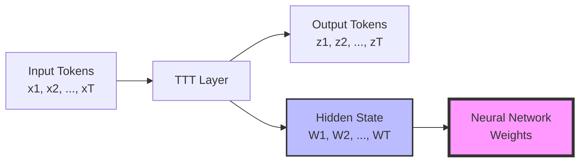
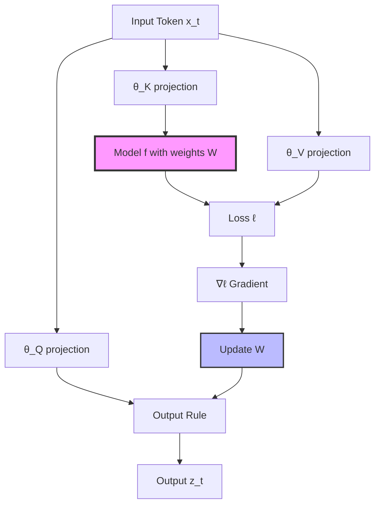
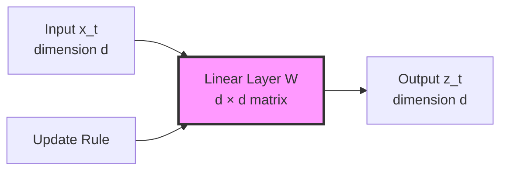
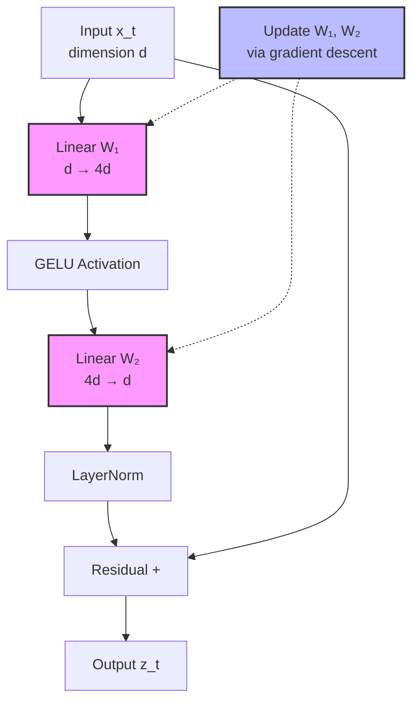
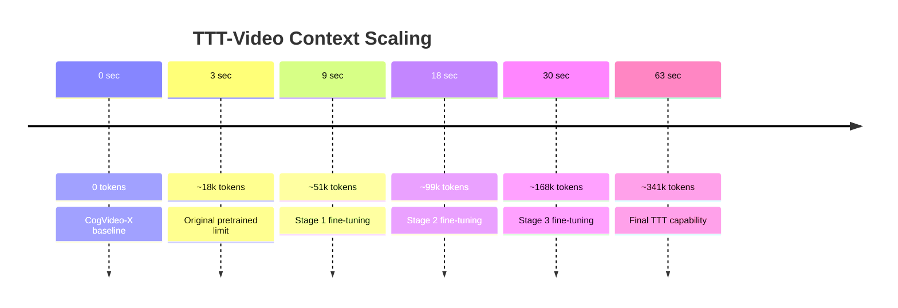
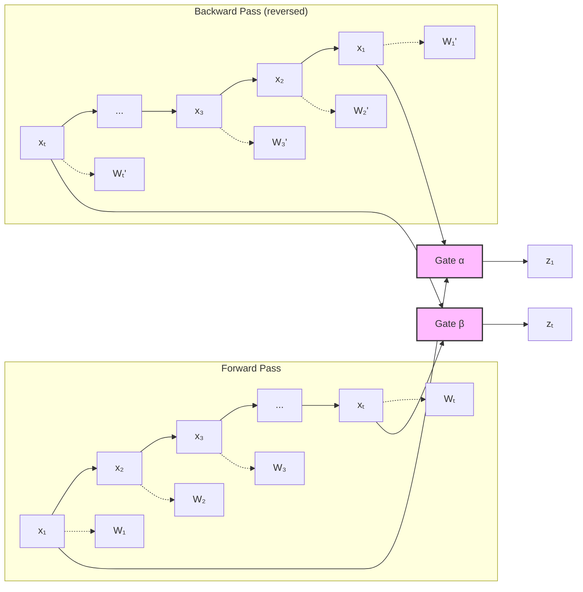
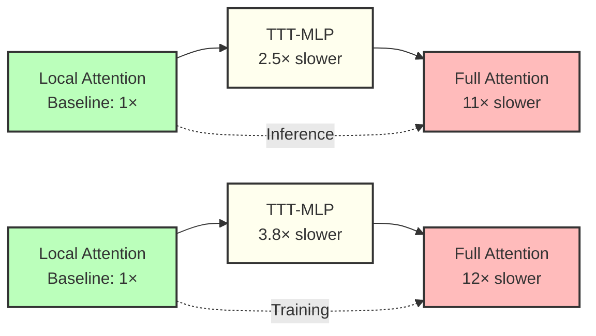

# Test-Time Training (TTT) - Comprehensive Overview

## Table of Contents
1. [Core Concept](#core-concept)
2. [Architecture Details](#architecture-details)
3. [TTT-Linear vs TTT-MLP](#ttt-linear-vs-ttt-mlp)
4. [Long Context Capabilities](#long-context-capabilities)
5. [Performance Characteristics](#performance-characteristics)

---

## Core Concept

### What is TTT?

Test-Time Training (TTT) is a paradigm where **the hidden state itself is a machine learning model** that gets trained at test time through self-supervised learning.



**Key Innovation**: Unlike traditional RNNs that compress context into fixed-size vectors/matrices, TTT uses **neural networks as hidden states** that learn through gradient descent.

### Core Update Rule

```
W_t = W_{t-1} - η∇ℓ(W_{t-1}; x_t)
```

Where:
- `W_t` = Hidden state (neural network weights) at time t
- `η` = Learning rate (token-dependent)
- `ℓ` = Self-supervised loss function

### Self-Supervised Task (Learned)

Instead of handcrafting the learning task, TTT learns it end-to-end:

```
ℓ(W; x_t) = ∥f(θ_K x_t; W) - θ_V x_t∥²
```

Where:
- `θ_K x_t` = "Training view" (corrupted/projected input)
- `θ_V x_t` = "Label view" (reconstruction target)
- `f(·; W)` = Inner-loop model (linear or MLP)
- `θ_K, θ_V, θ_Q` = Learnable projections (analogous to Q/K/V in attention)



### Inner Loop vs Outer Loop

```mermaid
graph TB
    subgraph "Outer Loop (Meta-Learning)"
        OL1[Train θ_K, θ_V, θ_Q]
        OL2[Train rest of network]
        OL3[Optimize main task<br/>e.g., next-token prediction]
    end

    subgraph "Inner Loop (Test-Time Training)"
        IL1[Initialize W_0]
        IL2[For each token x_t]
        IL3[Compute ℓ(W; x_t)]
        IL4[Update W ← W - η∇ℓ]
        IL5[Output z_t = f(θ_Q x_t; W)]

        IL2 --> IL3 --> IL4 --> IL5 --> IL2
    end

    OL1 --> IL1
    OL2 --> IL1
    OL3 -.-> IL1

    style OL3 fill:#bbf,stroke:#333,stroke-width:2px
    style IL4 fill:#f9f,stroke:#333,stroke-width:2px
```

---

## Architecture Details

### TTT-Linear

**Hidden State Structure**:
```python
f(x; W) = Wx  # Linear model
```

**Characteristics**:
- Hidden state: `W ∈ ℝ^{d×d}` (matrix)
- ~4× larger than vector-valued states (e.g., Mamba)
- Equivalent to linear attention with batch gradient descent

**Memory Size**: O(d²) per layer



### TTT-MLP

**Hidden State Structure**:
```python
f(x; W) = x + LayerNorm(MLP(x))

where MLP(x) = GELU(x W₁ + b₁) W₂ + b₂
```

**Characteristics**:
- Two-layer MLP with 4× expansion factor
- Hidden dimension: 4 × input dimension
- GELU activation for rich nonlinearities
- LayerNorm + residual for stability

**Memory Size**: O(8d²) per layer (2 weight matrices)



### Comparison

| Feature | TTT-Linear | TTT-MLP |
|---------|-----------|---------|
| **Hidden State Size** | d² | 8d² (W₁: d×4d, W₂: 4d×d) |
| **Expressiveness** | Linear transformations | Nonlinear with GELU |
| **Complexity** | O(d² · T) | O(8d² · T) |
| **Best For** | Efficiency, moderate context | Complex patterns, very long context |
| **Inner Loop LR (η)** | 1.0 | 0.1 |
| **Speed** | ~2× faster | More accurate but slower |

---

## TTT-Linear vs TTT-MLP

### When to Use Each

**TTT-Linear** ✅ Best for:
- Initial prototyping
- Moderate context lengths (< 100k tokens)
- Limited compute budget
- Faster inference requirements
- Speech models where efficiency matters

**TTT-MLP** ✅ Best for:
- Very long context (> 300k tokens)
- Complex multi-scene tasks
- When maximum expressiveness needed
- Video/image generation
- Research experiments with adequate compute

### TTT-MLP Architecture Detail

```mermaid
graph TB
    subgraph "TTT-MLP Layer"
        X[Input Sequence<br/>x₁, x₂, ..., xₜ]

        X --> P1[θ_K Projection]
        X --> P2[θ_V Projection]
        X --> P3[θ_Q Projection]

        P1 --> MB[Mini-Batch<br/>Processing]
        P2 --> MB
        P3 --> MB

        subgraph "Mini-Batch Update (b=64)"
            MB --> F1[Forward: Z = GELU(X W₁) W₂]
            F1 --> LN[LayerNorm + Residual]
            LN --> Loss[L2 Loss:<br/>‖LN(Z) - θ_V x‖²]
            Loss --> Grad[∇ℓ Gradient]
            Grad --> W1U[Update W₁]
            Grad --> W2U[Update W₂]

            W1U --> F2[Output: z = f(θ_Q x; W_updated)]
            W2U --> F2
        end

        F2 --> Out[Output Sequence<br/>z₁, z₂, ..., zₜ]
    end

    style Loss fill:#fbb,stroke:#333,stroke-width:2px
    style W1U fill:#bbf,stroke:#333,stroke-width:2px
    style W2U fill:#bbf,stroke:#333,stroke-width:2px
```

---

## Long Context Capabilities

### Context Length Scaling

```mermaid
graph LR
    subgraph "Traditional Attention"
        A1[8k tokens] --> A2[O(T²) = 64M ops]
        A3[32k tokens] --> A4[O(T²) = 1B ops]
        A5[300k tokens] --> A6[O(T²) = 90B ops<br/>❌ Infeasible]
    end

    subgraph "TTT Layers"
        T1[8k tokens] --> T2[O(T) = 8k ops]
        T3[32k tokens] --> T4[O(T) = 32k ops]
        T5[300k tokens] --> T6[O(T) = 300k ops<br/>✅ Efficient]
    end

    style A6 fill:#fbb,stroke:#333,stroke-width:3px
    style T6 fill:#bfb,stroke:#333,stroke-width:3px
```

### Real-World Context

| Application | Tokens | Traditional Attn | TTT |
|-------------|--------|------------------|-----|
| Short speech (3 sec @ 12.5 Hz) | 38 | ✅ Fast | ✅ Fast |
| Conversation (1 min) | 750 | ✅ OK | ✅ Fast |
| Long dialogue (5 min) | 3,750 | ⚠️ Slow | ✅ Fast |
| Extended session (1 hour) | 45,000 | ❌ Too slow | ✅ Feasible |
| **Very long (10 hours)** | **450,000** | **❌ Impossible** | **✅ Possible** |

### TTT-Video Example

Successfully generates **1-minute videos** (300k+ tokens):



### Bi-Directional Processing (Non-Causal)

For diffusion models and other non-causal architectures:



**Code**:
```python
# Forward TTT
z_forward = TTT(x)  # x₁ → x₂ → ... → xₜ

# Backward TTT
x_reversed = reverse(x)  # xₜ → ... → x₂ → x₁
z_backward = TTT(x_reversed)
z_backward = reverse(z_backward)

# Combine with gating
output = gate_α(z_forward) + gate_β(z_backward) + x
```

---

## Performance Characteristics

### Memory Efficiency

```mermaid
graph TB
    subgraph "Transformer (Attention)"
        A1[KV Cache<br/>O(d · T)]
        A2[Context = 300k tokens]
        A3[Memory:<br/>~100 GB for d=4096]
    end

    subgraph "TTT-Linear"
        T1[Hidden State<br/>O(d²)]
        T2[Context = 300k tokens]
        T3[Memory:<br/>~70 MB for d=4096]
    end

    subgraph "TTT-MLP"
        M1[Hidden State<br/>O(8d²)]
        M2[Context = 300k tokens]
        M3[Memory:<br/>~550 MB for d=4096]
    end

    A3 -.->|1400× more| T3
    A3 -.->|180× more| M3

    style A3 fill:#fbb,stroke:#333,stroke-width:2px
    style T3 fill:#bfb,stroke:#333,stroke-width:2px
    style M3 fill:#bfb,stroke:#333,stroke-width:2px
```

### Computational Costs

**Training** (63-second video, CogVideo-X):
- Full attention: 12× slower than local attention
- **TTT-MLP: 3.8× slower** than local attention
- Gated DeltaNet: 1.8× slower than local attention

**Inference** (63-second video):
- Full attention: 11× slower than local attention
- **TTT-MLP: 2.5× slower** than local attention
- Still much better than quadratic attention!



### Scaling with Model Size

| Model Size | Context | Transformer | Mamba | TTT-Linear | TTT-MLP |
|------------|---------|-------------|-------|------------|---------|
| 125M | 8k | 3.5e5 | 2.0e5 | 2.0e5 | ~2.5e5 |
| 125M | 32k | 5.0e5 | 2.0e5 | 2.0e5 | ~2.5e5 |
| 1.3B | 8k | 4.0e5 | 2.5e5 | 2.5e5 | ~3.0e5 |
| 1.3B | 32k | 6.0e5 | 2.5e5 | 2.5e5 | ~3.0e5 |

**Key Insight**: TTT scales linearly with context length, while Transformer cost grows quadratically.

---

## Key Formulas Summary

### Update Rule
```
W_t = W_{t-1} - η∇ℓ(W_{t-1}; x_t)
```

### Self-Supervised Loss
```
ℓ(W; x_t) = ∥f(θ_K x_t; W) - θ_V x_t∥²
```

### Output Rule
```
z_t = f(θ_Q x_t; W_t)
```

### Token-Dependent Learning Rate
```
η_t = (η_base · token_idx · learnable_lr) / head_dim
```

### Mini-Batch Update (Parallelized)
```
W_{ib} = W_{(i-1)b} - (η/b) Σ_{t=(i-1)b+1}^{ib} ∇ℓ(W_{(i-1)b}; x_t)
```

---

## Why TTT Enables Very Long Context

1. **Compression Through Learning**: Context compressed into neural network weights (more expressive than matrices)
2. **Linear Complexity**: O(T) instead of O(T²)
3. **Adaptive Memory**: Hidden state adapts to input distribution at test time
4. **No Fixed Window**: Can process arbitrarily long sequences
5. **Streaming Compatible**: State management works with streaming architectures

```mermaid
graph TB
    A[Very Long Context<br/>100k+ tokens] --> B{How to Process?}

    B -->|Attention| C[❌ O(T²) = 10B+ ops<br/>Too slow/expensive]
    B -->|Linear RNN| D[⚠️ Fixed matrix state<br/>Information loss]
    B -->|TTT| E[✅ O(T) ops<br/>Neural network state<br/>Test-time learning]

    E --> F[Success!<br/>Long coherent generation]

    style C fill:#fbb,stroke:#333,stroke-width:2px
    style D fill:#ffe,stroke:#333,stroke-width:2px
    style E fill:#bfb,stroke:#333,stroke-width:3px
    style F fill:#bfb,stroke:#333,stroke-width:2px
```

---

## References

- Learning to (Learn at Test Time): RNNs with Expressive Hidden States (Sun et al., 2024)
- Titans: Learning to Memorize at Test Time (Behrouz et al., 2024)
- TTT-Video: One-Minute Video Generation with Test-Time Training (CVPR 2025)

---

**Next**: See `02_Moshi_Architecture.md` for detailed analysis of Moshi speech model architecture.
