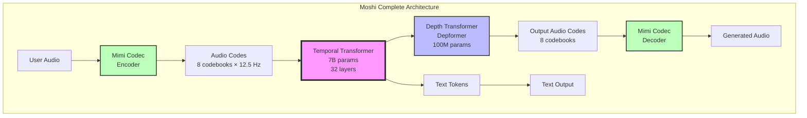
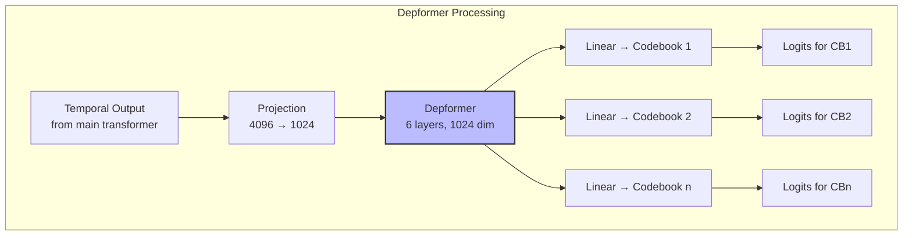
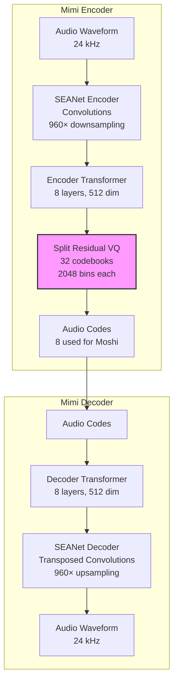
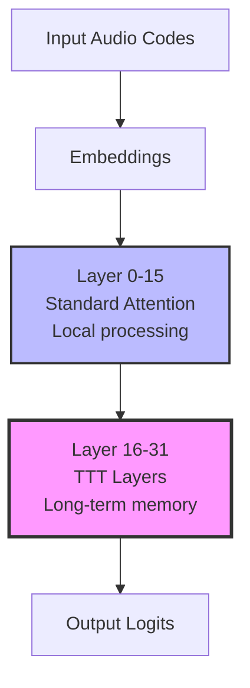
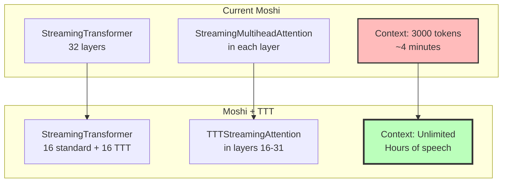

# Moshi Architecture - Detailed Analysis

## Table of Contents
1. [Overview](#overview)
2. [Architecture Components](#architecture-components)
3. [Temporal Transformer](#temporal-transformer)
4. [Depth Transformer (Depformer)](#depth-transformer-depformer)
5. [Mimi Audio Codec](#mimi-audio-codec)
6. [Streaming Architecture](#streaming-architecture)
7. [TTT Integration Points](#ttt-integration-points)

---

## Overview

Moshi is a **full-duplex**, **streaming**, **speech-to-speech** model with 7B parameters designed for real-time dialogue.



### Key Characteristics

| Feature | Specification |
|---------|--------------|
| **Model Size** | 7B parameters (main) + 100M (depformer) |
| **Context Length** | 3000 tokens = ~4 minutes @ 12.5 Hz |
| **Frame Rate** | 12.5 Hz (80ms per frame) |
| **Latency** | ~200ms total (80ms codec + 80ms model + 40ms overhead) |
| **Architecture** | Dual Transformer (Temporal + Depth) |
| **Streaming** | Full streaming with state management |
| **Duplex** | Full-duplex (simultaneous user + model audio) |
| **Attention** | Multi-head self-attention with RoPE |
| **Codebooks** | 8 audio + 1 text = 17 total streams |

---

## Architecture Components

### File Structure

```
moshi/moshi/moshi/
├── models/
│   ├── lm.py                    # Main LMModel class
│   ├── compression.py           # Mimi codec
│   ├── loaders.py              # Model loading utilities
│   └── tts.py                  # Text-to-speech variant
├── modules/
│   ├── transformer.py          # StreamingTransformer implementation
│   ├── conv.py                 # Convolutional layers
│   ├── rope.py                 # Rotary position embeddings
│   ├── streaming.py            # Streaming base classes
│   ├── gating.py               # SiLU gating mechanisms
│   └── seanet.py               # SEANet encoder/decoder
└── utils/
    └── ...
```

### Core Classes

**Main Model**: `LMModel` at `/home/user/claude-web/moshi/moshi/moshi/models/lm.py:49`

```python
class LMModel(StreamingModule[_LMModelState]):
    def __init__(self,
                 dim=4096,                    # Model dimension
                 num_heads=32,                # Attention heads
                 num_layers=32,               # Transformer layers
                 hidden_scale=4.125,          # FFN expansion
                 context=3000,                # Context window
                 causal=True,                 # Causal masking
                 ...):

        # Text embedding
        self.text_emb = ScaledEmbedding(text_card, dim)

        # Audio embeddings (one per codebook)
        self.emb = nn.ModuleList([
            ScaledEmbedding(card + 1, dim)
            for _ in range(n_q)
        ])

        # MAIN TEMPORAL TRANSFORMER ← TTT INTEGRATION TARGET
        self.transformer = StreamingTransformer(
            d_model=dim,
            num_heads=num_heads,
            num_layers=num_layers,
            ...
        )

        # Depth transformer for inter-codebook modeling
        self.depformer = StreamingTransformer(
            d_model=depformer_dim,
            num_heads=depformer_num_heads,
            num_layers=depformer_num_layers,
            context=depformer_context,  # Only 8 tokens
            ...
        )
```

---

## Temporal Transformer

### Purpose
Models temporal dependencies across the audio sequence (across time).

### Configuration (7B Model)

```python
{
  "dim": 4096,              # Model dimension
  "num_heads": 32,          # Attention heads
  "num_layers": 32,         # Transformer layers
  "hidden_scale": 4.125,    # FFN: 4096 → 16896 → 4096
  "context": 3000,          # 3000 tokens = ~4 min
  "causal": true,           # Causal masking
  "norm": "rms_norm_f32",   # RMSNorm in FP32
  "positional_embedding": "rope",  # Rotary embeddings
  "gating": "silu"          # SiLU activation
}
```

### Layer Structure

```mermaid
graph TB
    subgraph "StreamingTransformerLayer (32 layers)"
        Input[Input x<br/>shape: [B, T, 4096]]

        Input --> Norm1[RMSNorm]
        Norm1 --> SA[Multi-Head Self-Attention<br/>32 heads × 128 dim]

        SA --> Res1[Residual +]
        Input --> Res1

        Res1 --> Norm2[RMSNorm]
        Norm2 --> FFN[Feed-Forward Network<br/>SiLU Gating]

        FFN --> Res2[Residual +]
        Res1 --> Res2

        Res2 --> Output[Output<br/>shape: [B, T, 4096]]
    end

    style SA fill:#f9f,stroke:#333,stroke-width:3px
    style FFN fill:#bbf,stroke:#333,stroke-width:2px
```

**File**: `/home/user/claude-web/moshi/moshi/moshi/modules/transformer.py:586`

```python
class StreamingTransformerLayer(StreamingModule[_LayerState]):
    def forward(self, x, cross_attention_src=None):
        # Self-attention block ← TTT REPLACEMENT TARGET
        y = self._sa_block(
            self.norm1(x, self.step),
            x
        )

        # Feed-forward block (could also use TTT-MLP)
        y = self._ff_block(
            self.norm2(y, self.step),
            y
        )

        return y

    def _sa_block(self, x, residual):
        # Multi-head attention computation
        x = self.self_attn(x, x, x)  # ← REPLACE WITH TTT
        x = self.dropout(x)
        x = residual + x
        return x
```

### Attention Mechanism

**File**: `/home/user/claude-web/moshi/moshi/moshi/modules/transformer.py:328`

```python
class StreamingMultiheadAttention(StreamingModule[_MHAState]):
    def forward(self, query, key, value):
        # Q/K/V projections
        q = self.q_proj(query)
        k = self.k_proj(key)
        v = self.v_proj(value)

        # Apply RoPE embeddings
        q, k = self.rope(q, k, offset=self.state.offset_cpu)

        # Retrieve KV cache for streaming
        k, v = self._complete_kv(k, v)

        # Scaled dot-product attention ← CORE TO REPLACE
        output = F.scaled_dot_product_attention(
            q, k, v,
            attn_mask=self._make_causal_mask(...),
            ...
        )

        # Output projection
        output = self.out_proj(output)
        return output
```

### RoPE (Rotary Position Embeddings)

```mermaid
graph LR
    Q[Query q] --> R1[Apply Rotation<br/>θ = pos/10000^(2i/d)]
    K[Key k] --> R2[Apply Rotation<br/>θ = pos/10000^(2i/d)]

    R1 --> Dot[Dot Product<br/>q · k]
    R2 --> Dot

    Dot --> Attn[Attention Score]

    style R1 fill:#fbf,stroke:#333,stroke-width:2px
    style R2 fill:#fbf,stroke:#333,stroke-width:2px
```

**Advantages for TTT**:
- Position information injected before attention
- TTT can work with position-aware queries/keys
- No need to modify RoPE for TTT integration

---

## Depth Transformer (Depformer)

### Purpose
Models dependencies across codebook levels (depth dimension) within a single time step.

### Why Separate?
- Audio compression uses 8 hierarchical codebooks
- Lower codebooks = coarse structure (prosody, voice)
- Higher codebooks = fine details (phonetics, clarity)
- Depformer learns inter-codebook dependencies

### Configuration

```python
{
  "depformer_dim": 1024,
  "depformer_num_heads": 16,
  "depformer_num_layers": 6,
  "depformer_dim_feedforward": 4224,
  "depformer_context": 8,          # Very short context
  "depformer_multi_linear": true,
  "depformer_weights_per_step": true
}
```

### Architecture



**Not a primary TTT target** because:
- Only 8-token context (very short)
- Already efficient with standard attention
- Focus is on codebook interactions, not long-term memory

---

## Mimi Audio Codec

### Architecture



### Specifications

| Feature | Value |
|---------|-------|
| **Sample Rate** | 24 kHz |
| **Frame Rate** | 12.5 Hz (80ms frames) |
| **Frame Size** | 1920 samples |
| **Downsampling** | 960× (8×6×5×4 strides) |
| **Codebooks** | 32 total, 8 used for Moshi |
| **Cardinality** | 2048 bins per codebook |
| **Bitrate** | ~1.1 kbps |
| **Latency** | 80ms (one frame) |

**Why 12.5 Hz?**
- Lower frame rate = fewer autoregressive steps
- 50 Hz (competitors) → 50 steps/sec
- 12.5 Hz (Moshi) → 12.5 steps/sec (4× reduction!)
- Enables real-time generation on consumer hardware

---

## Streaming Architecture

### Core Streaming Classes

**File**: `/home/user/claude-web/moshi/moshi/moshi/modules/streaming.py`

```python
class StreamingModule(nn.Module, Generic[State]):
    """Base class for all streaming-capable modules."""

    @contextmanager
    def streaming(self, batch_size: int = 1):
        """Context manager for streaming mode."""
        self._streaming_state = self._init_streaming_state(batch_size)
        try:
            yield self
        finally:
            self._streaming_state = None

    def _init_streaming_state(self, batch_size: int) -> State:
        """Initialize streaming state."""
        raise NotImplementedError
```

### Streaming State for Attention

```python
@dataclass
class _MHAState(State):
    """State for Multi-Head Attention during streaming."""
    offset_cpu: int = 0          # Position in sequence
    past_keys: torch.Tensor      # KV cache for keys
    past_values: torch.Tensor    # KV cache for values
```

### Streaming State for LM

```python
@dataclass
class _LMModelState(State):
    """State for full LM during streaming."""
    transformer: _TransformerState    # Temporal transformer state
    depformer: _TransformerState      # Depformer state
```

### Streaming Example

```python
# Initialize streaming
with lm_model.streaming(batch_size=1):
    # Process frame by frame
    for audio_frame in audio_stream:
        # Encode audio → codes
        codes = mimi_encoder(audio_frame)  # [1, 8, 1]

        # Generate next frame
        output_codes, text_logits = lm_model.step(
            codes,        # User audio codes
            step_idx,     # Current step
        )

        # Decode audio
        output_audio = mimi_decoder(output_codes)

        # Stream output
        yield output_audio, text_logits
```

**Key Features**:
- **Causal**: Only looks at past, never future
- **Stateful**: Maintains KV cache and hidden states
- **Frame-level**: Processes exactly 80ms at a time
- **Low latency**: 200ms total (80ms + 80ms + 40ms)

---

## TTT Integration Points

### Priority 1: Temporal Transformer Attention ⭐⭐⭐

**File**: `/home/user/claude-web/moshi/moshi/moshi/modules/transformer.py:328-562`

**Replace**:
```python
class StreamingMultiheadAttention(StreamingModule[_MHAState]):
    def forward(self, query, key, value):
        # CURRENT: Scaled dot-product attention
        output = F.scaled_dot_product_attention(q, k, v, ...)
```

**With**:
```python
class TTTStreamingAttention(StreamingModule[_TTTState]):
    def forward(self, query, key, value):
        # NEW: TTT-based attention
        output = self.ttt_layer(query, key, value, self.state.W)
        # Update hidden state W via test-time learning
        self.state.W = self._update_hidden_state(...)
```

### Priority 2: Full Layer Replacement

**File**: `/home/user/claude-web/moshi/moshi/moshi/modules/transformer.py:586-790`

**Replace**:
```python
class StreamingTransformerLayer(StreamingModule[_LayerState]):
    def _sa_block(self, x, residual):
        x = self.self_attn(x, x, x)  # ← Replace entire block
        ...
```

**With**:
```python
class TTTStreamingLayer(StreamingModule[_TTTLayerState]):
    def _ttt_block(self, x, residual):
        # TTT-Linear or TTT-MLP
        x = self.ttt_layer(x, self.state.hidden_weights)
        self.state.hidden_weights = self._update_via_gradient_descent(...)
        ...
```

### Priority 3: Hybrid Approach

**Strategy**: Replace top 16 layers (layers 16-31) with TTT, keep bottom 16 layers standard attention.



**Rationale**:
- Bottom layers: Local pattern recognition (phonemes, words)
- Top layers: Long-range dependencies (conversation context, speaker style)
- TTT most valuable in top layers for long-context modeling

### Integration Diagram



### State Management for TTT

**Extend existing state**:
```python
@dataclass
class _TTTState(State):
    """Streaming state for TTT layer."""
    offset_cpu: int = 0

    # TTT-specific state
    W1: torch.Tensor = None      # Hidden weights (d×d or d×4d)
    b1: torch.Tensor = None      # Hidden biases
    W2: torch.Tensor = None      # (TTT-MLP only)
    b2: torch.Tensor = None      # (TTT-MLP only)

    # Learnable params (maintained across sequence)
    theta_K: torch.Tensor = None  # Key projection
    theta_V: torch.Tensor = None  # Value projection
    theta_Q: torch.Tensor = None  # Query projection
```

---

## Why Moshi is Perfect for TTT

### 1. Clean Separation

```
Temporal Transformer ← ADD TTT HERE
    ↓
Long-term temporal modeling
Perfect use case for TTT

Depth Transformer
    ↓
Short-term codebook dependencies
Keep standard attention
```

### 2. Streaming Architecture

- **Already streaming**: State management infrastructure exists
- **Causal design**: TTT works perfectly with causal models
- **Frame-based**: Natural mini-batching for TTT updates

### 3. Context Limitation

- **Current**: 3000 tokens = 4 minutes (limited)
- **Problem**: Conversation context forgotten beyond 4 min
- **TTT Solution**: Unlimited context via test-time learning

### 4. Code Quality

- **Modular**: Clean class hierarchy
- **Well-documented**: Extensive comments and docstrings
- **Production-ready**: Used in actual product
- **Type-annotated**: Modern Python practices

### 5. Pretrained Weights

- **Available on HuggingFace**: Easy to download
- **Multiple formats**: bf16, int8, int4 quantization
- **Proven quality**: 7M hours of training data

---

## Next Steps

See `03_Integration_Plan.md` for detailed step-by-step integration guide with code examples.
