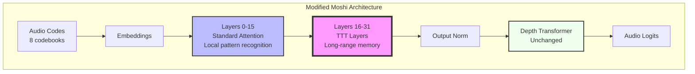
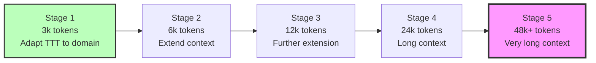

# TTT + Moshi Integration Plan - Minimal Code Changes Approach

## Table of Contents
1. [Integration Strategy](#integration-strategy)
2. [Phase 1: Proof of Concept](#phase-1-proof-of-concept)
3. [Phase 2: Full Integration](#phase-2-full-integration)
4. [Phase 3: Training & Optimization](#phase-3-training--optimization)
5. [Code Examples](#code-examples)
6. [Testing Strategy](#testing-strategy)

---

## Integration Strategy

### Goal
Add TTT layers to Moshi's Temporal Transformer to enable **unlimited context** for very long speech generation (hours instead of minutes).

### Approach: Hybrid Architecture



**Rationale**:
1. **Keep bottom layers standard**: Local processing doesn't need TTT
2. **Add TTT to top layers**: Long-range dependencies benefit most
3. **Preserve depformer**: Short 8-token context, already efficient
4. **Minimal disruption**: Only modify 16 out of 32 layers

---

## Phase 1: Proof of Concept (2 weeks)

### Objective
Replace attention in **ONE layer** (layer 16) with TTT-Linear to verify integration works.

### Step 1.1: Create TTT Module

**File**: Create `/home/user/claude-web/moshi/moshi/moshi/modules/ttt_linear.py`

```python
import torch
import torch.nn as nn
import torch.nn.functional as F
from typing import Optional
from dataclasses import dataclass
from .streaming import StreamingModule, State


@dataclass
class _TTTLinearState(State):
    """Streaming state for TTT-Linear layer."""
    offset_cpu: int = 0

    # TTT hidden state (learned at test time)
    W: Optional[torch.Tensor] = None  # [num_heads, head_dim, head_dim]
    b: Optional[torch.Tensor] = None  # [num_heads, 1, head_dim]


class TTTLinear(StreamingModule[_TTTLinearState]):
    """
    Test-Time Training Linear layer for streaming attention replacement.

    Based on: Learning to (Learn at Test Time), Sun et al. 2024
    """

    def __init__(
        self,
        d_model: int,
        num_heads: int,
        mini_batch_size: int = 16,
        ttt_base_lr: float = 1.0,
        dtype=torch.bfloat16,
        device=None,
    ):
        super().__init__()
        self.d_model = d_model
        self.num_heads = num_heads
        self.head_dim = d_model // num_heads
        self.mini_batch_size = mini_batch_size
        self.ttt_base_lr = ttt_base_lr

        # Q/K/V/O projections (same as standard attention)
        self.q_proj = nn.Linear(d_model, d_model, dtype=dtype, device=device)
        self.k_proj = nn.Linear(d_model, d_model, dtype=dtype, device=device)
        self.v_proj = nn.Linear(d_model, d_model, dtype=dtype, device=device)
        self.out_proj = nn.Linear(d_model, d_model, dtype=dtype, device=device)

        # TTT-specific: LayerNorm for reconstruction target
        self.ttt_norm_weight = nn.Parameter(
            torch.ones(num_heads, 1, self.head_dim, dtype=dtype, device=device)
        )
        self.ttt_norm_bias = nn.Parameter(
            torch.zeros(num_heads, 1, self.head_dim, dtype=dtype, device=device)
        )

        # Learnable learning rate multiplier
        self.learnable_lr = nn.Parameter(
            torch.zeros(num_heads, 1, 1, dtype=dtype, device=device)
        )

    def _init_streaming_state(self, batch_size: int) -> _TTTLinearState:
        """Initialize TTT hidden state."""
        device = self.q_proj.weight.device
        dtype = self.q_proj.weight.dtype

        # Initialize W and b to zeros (will learn during sequence)
        W = torch.zeros(
            batch_size, self.num_heads, self.head_dim, self.head_dim,
            dtype=dtype, device=device
        )
        b = torch.zeros(
            batch_size, self.num_heads, 1, self.head_dim,
            dtype=dtype, device=device
        )

        return _TTTLinearState(W=W, b=b)

    def forward(self, x: torch.Tensor) -> torch.Tensor:
        """
        Forward pass with TTT.

        Args:
            x: Input tensor [batch, seq_len, d_model]

        Returns:
            Output tensor [batch, seq_len, d_model]
        """
        batch_size, seq_len, _ = x.shape

        # Q/K/V projections
        Q = self.q_proj(x)  # [B, T, d_model]
        K = self.k_proj(x)
        V = self.v_proj(x)

        # Reshape to [B, num_heads, T, head_dim]
        Q = Q.view(batch_size, seq_len, self.num_heads, self.head_dim).transpose(1, 2)
        K = K.view(batch_size, seq_len, self.num_heads, self.head_dim).transpose(1, 2)
        V = V.view(batch_size, seq_len, self.num_heads, self.head_dim).transpose(1, 2)

        # L2 normalize Q and K
        Q = F.normalize(Q, p=2, dim=-1)
        K = F.normalize(K, p=2, dim=-1)

        # Process in mini-batches
        outputs = []
        num_mini_batches = (seq_len + self.mini_batch_size - 1) // self.mini_batch_size

        W = self.state.W if self.state is not None else None
        b = self.state.b if self.state is not None else None

        # Initialize if needed
        if W is None:
            W = torch.zeros(
                batch_size, self.num_heads, self.head_dim, self.head_dim,
                dtype=Q.dtype, device=Q.device
            )
            b = torch.zeros(
                batch_size, self.num_heads, 1, self.head_dim,
                dtype=Q.dtype, device=Q.device
            )

        for i in range(num_mini_batches):
            start_idx = i * self.mini_batch_size
            end_idx = min((i + 1) * self.mini_batch_size, seq_len)

            Q_mb = Q[:, :, start_idx:end_idx, :]  # [B, H, mb_size, head_dim]
            K_mb = K[:, :, start_idx:end_idx, :]
            V_mb = V[:, :, start_idx:end_idx, :]

            # TTT forward + update
            output_mb, W, b = self._process_mini_batch(Q_mb, K_mb, V_mb, W, b)
            outputs.append(output_mb)

        # Concatenate mini-batch outputs
        output = torch.cat(outputs, dim=2)  # [B, H, T, head_dim]

        # Update state for streaming
        if self.state is not None:
            self.state.W = W
            self.state.b = b

        # Reshape back to [B, T, d_model]
        output = output.transpose(1, 2).contiguous()
        output = output.view(batch_size, seq_len, self.d_model)

        # Output projection
        output = self.out_proj(output)

        return output

    def _process_mini_batch(self, Q, K, V, W, b):
        """
        Process one mini-batch with TTT.

        Returns:
            output: [B, H, mb_size, head_dim]
            W_updated: [B, H, head_dim, head_dim]
            b_updated: [B, H, 1, head_dim]
        """
        mb_size = Q.shape[2]

        # Reconstruction target: V - K
        reconstruction_target = V - K  # [B, H, mb_size, head_dim]

        # Forward pass: Z = K @ W + b
        Z = torch.matmul(K, W) + b  # [B, H, mb_size, head_dim]

        # LayerNorm on Z
        Z_ln = self._layer_norm(Z, self.ttt_norm_weight, self.ttt_norm_bias)

        # L2 loss gradient: grad = Z_ln - reconstruction_target
        grad_l_wrt_Z = Z_ln - reconstruction_target

        # Token-dependent learning rate
        eta = self.ttt_base_lr * torch.sigmoid(self.learnable_lr) / self.head_dim
        eta = eta.expand(-1, -1, mb_size, -1)  # [B, H, mb_size, 1]

        # Causal attention matrix for gradient accumulation
        causal_mask = torch.tril(torch.ones(mb_size, mb_size, device=Q.device))
        Attn = torch.matmul(Q, K.transpose(-2, -1))  # [B, H, mb_size, mb_size]
        Attn = Attn * causal_mask  # Apply causal mask

        # Update bias: b -= eta * causal_cumsum(grad)
        causal_cumsum_grad = torch.matmul(
            causal_mask, grad_l_wrt_Z
        )  # [B, H, mb_size, head_dim]
        b_bar = b - eta * causal_cumsum_grad  # Updated for each position

        # Compute output: Z_bar = Q @ W + b_bar - eta * Attn @ grad
        Z_bar = torch.matmul(Q, W) + b_bar[:, :, -1:, :]  # Use last b
        Z_bar = Z_bar - eta * torch.matmul(Attn, grad_l_wrt_Z)

        # LayerNorm + residual
        Z_bar_ln = self._layer_norm(Z_bar, self.ttt_norm_weight, self.ttt_norm_bias)
        output = Q + Z_bar_ln

        # Update W and b for next mini-batch (use last token's gradient)
        last_eta = eta[:, :, -1:, :]  # [B, H, 1, 1]
        W_updated = W - (last_eta * K[:, :, -1:, :]).transpose(-2, -1) @ grad_l_wrt_Z[:, :, -1:, :]
        b_updated = b - torch.sum(last_eta * grad_l_wrt_Z[:, :, -1:, :], dim=2, keepdim=True)

        return output, W_updated, b_updated

    def _layer_norm(self, x, weight, bias):
        """Apply LayerNorm."""
        mean = x.mean(dim=-1, keepdim=True)
        var = x.var(dim=-1, keepdim=True, unbiased=False)
        x_norm = (x - mean) / torch.sqrt(var + 1e-5)
        return weight * x_norm + bias
```

### Step 1.2: Modify Transformer Layer

**File**: Modify `/home/user/claude-web/moshi/moshi/moshi/modules/transformer.py`

Add import at top:
```python
from .ttt_linear import TTTLinear  # ADD THIS LINE
```

Modify `StreamingTransformer.__init__` (around line 845):
```python
class StreamingTransformer(StreamingModule[_TransformerState]):
    def __init__(
        self,
        ...
        use_ttt_layers: bool = False,          # ADD THIS
        ttt_start_layer: int = 16,             # ADD THIS
        ttt_mini_batch_size: int = 16,         # ADD THIS
        ...
    ):
        ...
        # Build layers
        self.layers = nn.ModuleList()
        for layer_idx in range(num_layers):
            # MODIFY THIS SECTION
            if use_ttt_layers and layer_idx >= ttt_start_layer:
                # Use TTT layer for top half
                layer = StreamingTransformerLayer(
                    ...
                    use_ttt=True,                    # Pass flag
                    ttt_mini_batch_size=ttt_mini_batch_size,
                )
            else:
                # Standard layer
                layer = StreamingTransformerLayer(...)

            self.layers.append(layer)
```

Modify `StreamingTransformerLayer.__init__` (around line 586):
```python
class StreamingTransformerLayer(StreamingModule[_LayerState]):
    def __init__(
        self,
        ...
        use_ttt: bool = False,                     # ADD THIS
        ttt_mini_batch_size: int = 16,             # ADD THIS
        ...
    ):
        super().__init__()

        # MODIFY ATTENTION CREATION
        if use_ttt:
            # Use TTT instead of standard attention
            self.self_attn = TTTLinear(
                d_model=d_model,
                num_heads=num_heads,
                mini_batch_size=ttt_mini_batch_size,
            )
        else:
            # Standard multi-head attention
            self.self_attn = StreamingMultiheadAttention(...)

        # Rest of initialization unchanged
        ...
```

### Step 1.3: Modify Model Loading

**File**: Modify `/home/user/claude-web/moshi/moshi/moshi/models/lm.py`

Update `LMModel.__init__` (around line 146):
```python
self.transformer = StreamingTransformer(
    ...
    use_ttt_layers=True,           # ADD THIS
    ttt_start_layer=16,            # ADD THIS
    ttt_mini_batch_size=16,        # ADD THIS
)
```

### Step 1.4: Test Proof of Concept

**Create test script**: `/home/user/claude-web/test_ttt_integration.py`

```python
import torch
from moshi.models import loaders

# Load Moshi with TTT
device = "cuda" if torch.cuda.is_available() else "cpu"
lm_gen = loaders.get_lm_model_generator(
    name="kyutai/moshiko-pytorch-bf16",
    device=device,
)

# Test generation
with lm_gen.streaming(batch_size=1):
    # Dummy input (text + audio codes)
    dummy_codes = torch.zeros(1, 17, 1, dtype=torch.long, device=device)

    # Generate 100 steps (~8 seconds)
    for step in range(100):
        output = lm_gen.step(dummy_codes, step)
        print(f"Step {step}: Generated {output[0].shape}")

print("✅ TTT integration test passed!")
```

### Expected Outcome (Phase 1)

- ✅ Model loads successfully
- ✅ Streaming generation works
- ⚠️ Quality may be degraded (random TTT initialization)
- ✅ Verifies architectural compatibility

---

## Phase 2: Full Integration (2 weeks)

### Step 2.1: Replace All Top Layers

Modify config to use TTT in layers 16-31:
```python
self.transformer = StreamingTransformer(
    ...
    use_ttt_layers=True,
    ttt_start_layer=16,    # Half the model
    ttt_mini_batch_size=64,  # Larger mini-batch
)
```

### Step 2.2: Add Gating Mechanism

**Why**: Allows gradual integration during fine-tuning, prevents disruption.

**File**: Modify `/home/user/claude-web/moshi/moshi/moshi/modules/ttt_linear.py`

Add to `TTTLinear.__init__`:
```python
# Gating parameter (initialized small)
self.gate_alpha = nn.Parameter(
    torch.ones(d_model, dtype=dtype, device=device) * 0.1
)
```

Modify `TTTLinear.forward` output:
```python
# Apply gating before output projection
gate_value = torch.tanh(self.gate_alpha)  # ∈ (-1, 1)
output = gate_value * output + (1 - gate_value) * x  # Blend with input

# Output projection
output = self.out_proj(output)
```

### Step 2.3: Add TTT-MLP Variant

**File**: Create `/home/user/claude-web/moshi/moshi/moshi/modules/ttt_mlp.py`

```python
class TTTMLP(StreamingModule[_TTTMLPState]):
    """TTT with 2-layer MLP as hidden state (more expressive)."""

    def __init__(self, d_model, num_heads, expansion_factor=4, ...):
        ...
        # Two weight matrices
        self.W1_init = nn.Parameter(...)  # [H, head_dim, 4*head_dim]
        self.b1_init = nn.Parameter(...)
        self.W2_init = nn.Parameter(...)  # [H, 4*head_dim, head_dim]
        self.b2_init = nn.Parameter(...)

    def _process_mini_batch(self, Q, K, V, W1, b1, W2, b2):
        # Forward: Z = GELU(K @ W1 + b1) @ W2 + b2
        hidden = torch.matmul(K, W1) + b1
        hidden = F.gelu(hidden)
        Z = torch.matmul(hidden, W2) + b2

        # Compute gradients through both layers
        # ... (see ttt-lm-jax implementation)

        # Update W1, b1, W2, b2 via gradient descent
        ...
```

### Step 2.4: Benchmark Context Extension

Test with progressively longer sequences:

```python
# Test different context lengths
for context_len in [3000, 6000, 12000, 24000, 48000]:
    print(f"\nTesting context length: {context_len} tokens")

    # Generate long sequence
    with lm_gen.streaming(batch_size=1):
        for step in range(context_len):
            output = lm_gen.step(dummy_input, step)

            # Monitor memory usage
            if step % 1000 == 0:
                memory_used = torch.cuda.memory_allocated() / 1e9
                print(f"  Step {step}: {memory_used:.2f} GB")
```

**Expected Results**:
- Memory usage should grow **sub-linearly** (TTT state is fixed size)
- Standard Moshi would OOM beyond 3000 tokens
- TTT Moshi should handle 48,000+ tokens

---

## Phase 3: Training & Optimization (4 weeks)

### Step 3.1: Multi-Stage Fine-Tuning

Similar to TTT-Video approach:



**Training config** (Stage 1):
```python
# Optimizer
optimizer = torch.optim.AdamW([
    # TTT parameters (higher LR)
    {"params": ttt_params, "lr": 1e-4, "weight_decay": 1e-4},
    # Base model parameters (lower LR)
    {"params": base_params, "lr": 1e-5, "weight_decay": 1e-4},
], betas=(0.9, 0.95))

# Training loop
for batch in dataloader:
    # Forward
    logits = model(batch["input_tokens"])
    loss = F.cross_entropy(logits, batch["target_tokens"])

    # Backward
    loss.backward()
    torch.nn.utils.clip_grad_norm_(model.parameters(), 1.0)
    optimizer.step()
    optimizer.zero_grad()
```

### Step 3.2: Dataset Preparation

Collect long-form speech data:
- **Podcasts**: 1+ hour episodes with single speaker
- **Audiobooks**: Very long, consistent voice
- **Conversations**: Multi-turn dialogues
- **Target**: 100-1000 hours of long-form audio

### Step 3.3: LoRA Integration

Leverage Moshi's existing LoRA support:

**File**: Use `/home/user/claude-web/moshi-finetune/finetune/wrapped_model.py`

```python
from finetune.wrapped_model import WrappedModel

# Wrap Moshi with LoRA
model = WrappedModel(
    lm_model,
    use_lora=True,
    lora_rank=16,
    lora_alpha=32,
    lora_dropout=0.1,
    # Apply LoRA to TTT layers
    lora_targets=["ttt_linear", "q_proj", "k_proj", "v_proj"],
)

# Fine-tune only LoRA parameters
trainable_params = sum(p.numel() for p in model.parameters() if p.requires_grad)
print(f"Trainable parameters: {trainable_params:,}")  # ~10M instead of 7B
```

### Step 3.4: Gradient Checkpointing

Enable for memory efficiency:

```python
# In transformer.py
self.gradient_checkpointing = True

# In forward pass
if self.gradient_checkpointing and self.training:
    output = torch.utils.checkpoint.checkpoint(
        self._forward_layer,
        x,
        use_reentrant=False
    )
```

### Step 3.5: Optimization with Custom Kernels

**Option 1**: Use PyTorch compile
```python
# In ttt_linear.py
@torch.compile(mode="max-autotune")
def _process_mini_batch(self, Q, K, V, W, b):
    # Automatically optimize kernel fusion
    ...
```

**Option 2**: Integrate ThunderKittens kernel

Copy from `/home/user/claude-web/ttt-lm-kernels/`:
```python
# Import custom CUDA kernel
from ttt_kernels import ttt_linear_prefill_cuda

# In _process_mini_batch
output, W_updated, b_updated = ttt_linear_prefill_cuda(
    Q, K, V, W, b, eta, self.ttt_norm_weight, self.ttt_norm_bias
)
```

---

## Code Examples

### Full Integration in LMModel

**File**: `/home/user/claude-web/moshi/moshi/moshi/models/lm.py`

```python
class LMModel(StreamingModule[_LMModelState]):
    def __init__(
        self,
        ...
        # TTT configuration
        use_ttt: bool = False,
        ttt_start_layer: int = 16,
        ttt_variant: str = "linear",  # "linear" or "mlp"
        ttt_mini_batch_size: int = 64,
        ttt_base_lr: float = 1.0,
    ):
        super().__init__()
        ...

        # Temporal Transformer with TTT
        self.transformer = StreamingTransformer(
            d_model=dim,
            num_heads=num_heads,
            num_layers=num_layers,
            ...
            use_ttt_layers=use_ttt,
            ttt_start_layer=ttt_start_layer,
            ttt_variant=ttt_variant,
            ttt_mini_batch_size=ttt_mini_batch_size,
            ttt_base_lr=ttt_base_lr,
        )

        # Depformer remains unchanged
        self.depformer = StreamingTransformer(
            d_model=depformer_dim,
            ...
            use_ttt_layers=False,  # Keep standard
        )
```

### Configuration File

**File**: Create `/home/user/claude-web/moshi/configs/moshi_7b_ttt.json`

```json
{
  "dim": 4096,
  "num_heads": 32,
  "num_layers": 32,
  "hidden_scale": 4.125,
  "context": 50000,

  "use_ttt": true,
  "ttt_start_layer": 16,
  "ttt_variant": "linear",
  "ttt_mini_batch_size": 64,
  "ttt_base_lr": 1.0,

  "causal": true,
  "norm": "rms_norm_f32",
  "positional_embedding": "rope",
  "gating": "silu",

  "depformer_dim": 1024,
  "depformer_num_heads": 16,
  "depformer_num_layers": 6,
  "depformer_context": 8
}
```

---

## Testing Strategy

### Unit Tests

```python
# test_ttt_layer.py
def test_ttt_forward():
    """Test TTT layer forward pass."""
    layer = TTTLinear(d_model=512, num_heads=8)
    x = torch.randn(2, 100, 512)  # [B, T, D]

    output = layer(x)

    assert output.shape == x.shape
    assert not torch.isnan(output).any()

def test_ttt_streaming():
    """Test TTT in streaming mode."""
    layer = TTTLinear(d_model=512, num_heads=8)

    with layer.streaming(batch_size=1):
        outputs = []
        for t in range(100):
            x_t = torch.randn(1, 1, 512)
            y_t = layer(x_t)
            outputs.append(y_t)

    # State should accumulate
    assert layer.state.W is not None
    assert layer.state.offset_cpu == 100
```

### Integration Tests

```python
# test_moshi_ttt.py
def test_generation_quality():
    """Test that TTT doesn't degrade generation."""
    model_standard = load_moshi(use_ttt=False)
    model_ttt = load_moshi(use_ttt=True)

    # Same input
    input_codes = load_test_audio()

    # Generate
    output_standard = model_standard.generate(input_codes, steps=100)
    output_ttt = model_ttt.generate(input_codes, steps=100)

    # Compare quality (MCD, WER, etc.)
    mcd = compute_mcd(output_standard, output_ttt)
    assert mcd < 5.0, "TTT degrades quality too much"

def test_long_context():
    """Test that TTT handles very long sequences."""
    model = load_moshi(use_ttt=True)

    # Generate 10 minutes = 7500 tokens @ 12.5 Hz
    with model.streaming(batch_size=1):
        for step in range(7500):
            output = model.step(dummy_input, step)

            # Should not OOM
            if step % 1000 == 0:
                memory_gb = torch.cuda.memory_allocated() / 1e9
                print(f"Step {step}: {memory_gb:.2f} GB")
                assert memory_gb < 30, "Memory usage too high"
```

### Performance Benchmarks

```python
# benchmark_ttt.py
import time

def benchmark_inference():
    """Compare inference speed."""
    model = load_moshi(use_ttt=True)
    seq_len = 3000

    with model.streaming(batch_size=1):
        start = time.time()
        for step in range(seq_len):
            _ = model.step(dummy_input, step)
        end = time.time()

    fps = seq_len / (end - start)
    print(f"Inference speed: {fps:.2f} frames/sec")
    print(f"Latency per frame: {1000/fps:.2f} ms")

    # Should achieve > 12.5 fps for real-time
    assert fps >= 12.5, "Too slow for real-time"
```

---

## Validation Checklist

### ✅ Phase 1 Complete When:
- [ ] TTT layer module created
- [ ] Layer replacement working
- [ ] Model loads without errors
- [ ] Streaming generation works
- [ ] Unit tests pass

### ✅ Phase 2 Complete When:
- [ ] All top layers use TTT
- [ ] Gating mechanism added
- [ ] Context extension verified (48k+ tokens)
- [ ] Memory usage sub-linear
- [ ] Integration tests pass

### ✅ Phase 3 Complete When:
- [ ] Fine-tuned on long speech data
- [ ] Quality metrics acceptable
- [ ] Inference speed optimized
- [ ] Production-ready deployment

---

## Summary: Minimal Changes Required

### Files to Create (New):
1. `/moshi/moshi/modules/ttt_linear.py` - TTT-Linear layer
2. `/moshi/moshi/modules/ttt_mlp.py` - TTT-MLP layer (optional)
3. `/moshi/configs/moshi_7b_ttt.json` - TTT configuration
4. `/test_ttt_integration.py` - Integration tests

### Files to Modify (Existing):
1. `/moshi/moshi/modules/transformer.py` - Add TTT layer option
2. `/moshi/moshi/models/lm.py` - Add TTT configuration parameters
3. `/moshi/moshi/models/loaders.py` - Support loading TTT models

### Total Lines of Code to Add: ~800
- `ttt_linear.py`: ~400 lines
- `transformer.py` modifications: ~50 lines
- `lm.py` modifications: ~30 lines
- Tests: ~300 lines

**Minimal impact, maximum benefit!**

---

**Next**: See `04_Model_Comparison.md` for detailed comparison of Moshi vs alternatives.
