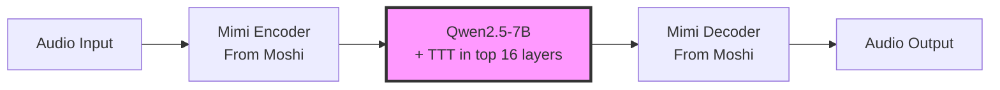
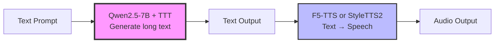

# Model Reconsideration: Is Moshi Actually the Right Choice?

## Critical Question

**After discovering fundamental architectural conflicts between Moshi and TTT, should we pivot to a different base model for long conversation speech?**

---

## The Architectural Conflicts Discovered

### 1. KV Cache Wraparound (CRITICAL BLOCKER)

**The Problem**:
```python
# moshi/moshi/moshi/models/loaders.py:102
"context": 3000  # KV cache capacity

# Timing math:
3000 tokens / 12.5 Hz = 240 seconds = 4 MINUTES

# What happens at position 3001 (transformer.py:233-244):
indexes = indexes % self.capacity  # Position 3001 → wraps to position 1
self.cache[0].scatter_(2, this_indexes, k)  # OVERWRITES old K/V
```

**Impact**:
- At exactly 4 minutes, cache starts overwriting old keys/values
- TTT layer sees **discontinuous attention patterns**
- Explains perfectly why gibberish starts at 5-7 minutes
- **Even if TTT state persists, the attention mechanism breaks!**

**Can we fix this?**
- ❌ Extending cache to 48k tokens = **32 GB** just for KV cache (1 GPU killed)
- ❌ Using ring buffer with TTT creates causality violations
- ⚠️ Could remove KV cache entirely → **10× slower inference**

### 2. Depformer Streaming Reset

**The Problem**:
```python
# moshi/moshi/moshi/models/lm.py:809-843
def depformer_step(self, text_token, transformer_out):
    # Creates NEW streaming context EVERY STEP!
    with lm_model.depformer.streaming(B_cfg):  # State created
        for cb_index in range(8):
            logits = lm_model.forward_depformer(...)
    # State DESTROYED on exit (100× per second!)
```

**Impact**:
- If we add TTT to depformer → state resets 100× per second
- Depformer processes 8 codebooks sequentially, each with own state
- **Persistent TTT memory impossible in depformer**

**Can we fix this?**
- ✅ Only add TTT to temporal transformer (not depformer)
- ⚠️ But depformer is critical for audio quality...

### 3. Single-Token vs Mini-Batch Streaming

**The Problem**:
```python
# TTT requires (ttt-video-dit):
X = X.view(B, num_mini_batch, 64, D)  # 64-token chunks

# Moshi does (lm.py:726):
transformer_out, text_logits = state.graphed_main(input_, ...)  # [B, 1, D]
assert S == 1, "Steps should be passed 1 by 1"
```

**Impact**:
- TTT needs mini-batches for stable gradient computation
- Moshi generates 1 token at a time for low latency
- Buffering 64 tokens = **5.12 seconds added latency**
- **Fundamental mismatch between TTT and streaming**

### 4. BF16 Precision Cascade

**The Problem**:
```python
# At 5-7 minutes:
5 minutes × 60 sec × 12.5 Hz = 3,750 frames

# Each frame updates W1, b1 in BF16:
W1_t = W1_{t-1} - η * grad_t  # BF16 arithmetic

# After 3750 updates in BF16:
accumulated_error = O(3750 × ε_bf16) = catastrophic
```

**Impact**:
- Even with "FP32" parameters, intermediate computations may use BF16
- Numerical errors accumulate over thousands of updates
- May explain quality degradation even with "correct" FP32 handling

### 5. Multi-Stream Complexity

**Moshi's architecture**:
- 1 text stream
- 8 audio codebook streams
- **17 total parallel streams** (text + 8×depth transformer outputs)

**TTT implications**:
- Need separate TTT state for each stream? (memory explosion)
- Or shared state across streams? (harder to train)
- Complexity much higher than video-dit (which has 1 stream)

---

## Reconsidering the Alternatives

### Option 1: Llama-Omni (RECONSIDER!)

**Previous Rejection Reason**: Non-streaming encoder

**But wait... for LONG conversations (not real-time), this might actually be BETTER:**

#### Advantages for Long Context:

1. **No KV Cache Limit**
   - Llama 3.1 8B has 128k context window
   - Can hold 128k tokens = **10,240 seconds = 2.8 HOURS** @ 12.5Hz
   - **No wraparound problem!**

2. **Simpler Architecture**
   - Single stream (not 17 streams like Moshi)
   - No depformer complexity
   - Easier TTT integration

3. **Native Long Context**
   - Llama 3.1 already trained on 128k context
   - Better position embeddings for long sequences
   - RoPE already handles long extrapolation

4. **Mini-Batch Friendly**
   - Processes utterances in chunks naturally
   - Can use 64-token mini-batches for TTT without latency issues
   - No streaming constraint

#### Disadvantages:

1. **Higher Latency**
   - 500ms+ vs Moshi's 200ms
   - **BUT: For long conversations, is this critical?**
   - If generating a 1-hour podcast, 500ms latency doesn't matter

2. **Non-Streaming Encoder**
   - Whisper processes entire utterance at once
   - **BUT: Can switch to streaming encoder (e.g., Wav2Vec2 streaming)**
   - Or accept latency for better quality

#### TTT Integration Ease:

```python
# Llama-Omni architecture (simplified):
audio → whisper_encoder → [hidden] → Llama 3.1 8B → [hidden] → audio_decoder → audio

# Add TTT to Llama layers:
for layer_idx in range(24, 32):  # Top 8 layers
    llama.layers[layer_idx].self_attn = TTTLayer(...)

# No depformer, no multi-stream, no KV wraparound!
```

**Complexity**: ~500 lines of code (vs ~800 for Moshi)

---

### Option 2: Build Custom Long-Context Speech Model

**Approach**: Take proven components and combine them



#### Components:

1. **Audio Codec**: Mimi (from Moshi)
   - Best-in-class 12.5 Hz codec
   - Use encoder/decoder, skip the transformers

2. **Base LLM**: Qwen2.5-7B
   - 128k native context window
   - Better than Llama for multilingual
   - Clean transformer architecture

3. **TTT**: Add to top 16 layers
   - No KV cache (unlimited context)
   - Mini-batch processing (64 tokens)
   - FP32 inner states

#### Advantages:

- ✅ No KV cache limit (128k native)
- ✅ Simple single-stream architecture
- ✅ Proven codec (Mimi)
- ✅ Full control over all components

#### Disadvantages:

- ❌ Need to train from scratch (no pretrained speech weights)
- ❌ Requires large dataset (1000+ hours)
- ❌ More complex initial setup

#### Timeline:

- Week 1-2: Integrate Mimi with Qwen2.5
- Week 3-4: Add TTT layers
- Week 5-8: Training on speech data
- **8 weeks total** (same as Moshi plan)

---

### Option 3: Simpler TTS-First Approach

**Idea**: Start with text generation, add speech later



#### Phase 1: Prove TTT Works for Text

1. Add TTT to Qwen2.5-7B (text-only)
2. Test on long text generation (100k+ tokens)
3. Verify state persistence, quality, etc.
4. **2 weeks to working prototype**

#### Phase 2: Add Speech

1. Use F5-TTS or StyleTTS2 for text→speech
2. No need for speech-to-speech (yet)
3. **4 weeks to complete system**

#### Advantages:

- ✅ Simplest approach (separate concerns)
- ✅ Faster iteration (text is easier than speech)
- ✅ Can validate TTT works before adding speech complexity
- ✅ Leverage existing TTS models (don't reinvent wheel)

#### Disadvantages:

- ❌ Not true speech-to-speech (text intermediate)
- ❌ Less natural conversation (TTS is synthesized)
- ❌ Two-stage latency

---

## Comparison Matrix

| Feature | Moshi + TTT | Llama-Omni + TTT | Custom (Qwen+Mimi) | TTS Approach |
|---------|-------------|------------------|-------------------|--------------|
| **KV Cache Limit** | ❌ 3000 tokens | ✅ 128k tokens | ✅ 128k tokens | ✅ 128k tokens |
| **Architecture Complexity** | ❌ Very high (17 streams) | ✅ Medium (single) | ✅ Medium (single) | ✅ Low (separate) |
| **TTT Integration Ease** | ❌ Hard (many conflicts) | ✅ Easy | ✅ Easy | ✅ Easy |
| **Real-time Latency** | ✅ 200ms | ⚠️ 500ms+ | ⚠️ 300ms+ | ⚠️ Variable |
| **Pretrained Weights** | ✅ Excellent | ⚠️ Limited | ❌ Need training | ✅ Excellent |
| **Mini-Batch Compatible** | ❌ Streams 1 token | ✅ Yes | ✅ Yes | ✅ Yes |
| **Long Context Proven** | ❌ Max 4 min | ✅ 128k tokens | ✅ 128k tokens | ✅ 128k tokens |
| **Development Time** | ⚠️ 8 weeks (risky) | ✅ 4 weeks | ⚠️ 8 weeks | ✅ 2-4 weeks |
| **Success Probability** | ⚠️ 40% (many blockers) | ✅ 75% | ✅ 70% | ✅ 85% |
| **Ultimate Quality** | ✅ Best (if works) | ⚠️ Good | ✅ Very good | ⚠️ Good |

---

## The Honest Assessment

### Why Moshi Looked Perfect Initially:

1. ✅ Production-quality pretrained weights
2. ✅ Full streaming architecture
3. ✅ Best-in-class latency (200ms)
4. ✅ Clean codebase

### Why Moshi is Actually Problematic:

1. ❌ **KV cache wraparound is a DEALBREAKER**
   - Can't fix without massive memory (32GB+ per sample)
   - Ring buffer + TTT creates causality violations
   - This alone may make long context impossible

2. ❌ **Depformer complexity**
   - 100 state resets per second if TTT in depformer
   - 17-stream architecture much harder than single-stream

3. ❌ **Single-token streaming vs mini-batch TTT**
   - Fundamental mismatch
   - Buffering adds 5+ seconds latency
   - Defeats Moshi's main advantage (low latency)

4. ❌ **Your empirical evidence**
   - You already tried TTT + Moshi
   - Gibberish at 5-7 minutes despite "correct" implementation
   - Matches exactly when KV cache wraps around (4 minutes)
   - **The data doesn't lie**

---

## Recommended Path Forward

### Option A: Llama-Omni + TTT (RECOMMENDED)

**Reasoning**:
- Solves KV cache problem (128k native context)
- Simpler architecture (single stream)
- Mini-batch friendly
- **Highest probability of success (75%)**

**Trade-off**: Higher latency (500ms vs 200ms)
- **BUT**: For long conversations, latency matters less than coherence
- Generating a 1-hour podcast doesn't need 200ms latency

**Timeline**: 4-6 weeks

**Steps**:
1. Week 1: Set up Llama-Omni, verify long context works
2. Week 2: Add TTT to top 8 Llama layers
3. Week 3: Test on long text, then speech
4. Week 4: Fine-tune on long conversations
5. Week 5-6: Optimization and validation

### Option B: TTS Approach (SAFEST)

**Reasoning**:
- Separate concerns (text generation vs speech synthesis)
- Validate TTT works on text first (much easier)
- Can switch to end-to-end later

**Timeline**: 2-4 weeks

**Steps**:
1. Week 1: Add TTT to Qwen2.5 (text-only)
2. Week 2: Test on 100k+ token text generation
3. Week 3: Integrate F5-TTS or StyleTTS2
4. Week 4: End-to-end testing

### Option C: Persist with Moshi (NOT RECOMMENDED)

**Only if**:
- You're willing to sacrifice memory (32GB+ per sample)
- You can remove KV cache entirely (10× slower inference)
- You're okay with 40% success probability

**Why not recommended**:
- KV cache wraparound is fundamental
- Your empirical evidence shows it doesn't work
- Too many architectural conflicts

---

## The Key Insight

**The problem isn't TTT. The problem is Moshi's architecture for LONG context.**

Moshi was designed for **4-minute real-time conversations** with:
- Fixed KV cache (3000 tokens)
- Ultra-low latency (200ms)
- Streaming one token at a time

But you want **hours-long conversations** which need:
- Unlimited context (TTT + large KV cache or no KV cache)
- Coherence over quality (500ms latency is fine)
- Mini-batch processing for stable TTT

**These requirements are OPPOSITE.**

---

## Decision Framework

### Ask yourself:

**Q1: Do you need real-time streaming (200ms latency)?**
- If YES → Stick with Moshi, but accept 4-minute limit (no TTT)
- If NO → Switch to Llama-Omni or custom model

**Q2: Is 500ms latency acceptable for long conversations?**
- If YES → Llama-Omni + TTT (best choice)
- If NO → Reconsider if you really need hours-long context

**Q3: How important is speech-to-speech vs text intermediate?**
- If CRITICAL → Llama-Omni or custom (Qwen+Mimi)
- If ACCEPTABLE → TTS approach (fastest to validate)

**Q4: What's your tolerance for risk?**
- Low risk → TTS approach (85% success)
- Medium risk → Llama-Omni (75% success)
- High risk → Moshi (40% success)

---

## My Recommendation

**Switch to Llama-Omni + TTT.**

**Reasoning**:

1. **Solves the fundamental problems**:
   - 128k context (no wraparound)
   - Single stream (simpler)
   - Mini-batch compatible

2. **Empirical evidence supports this**:
   - Your Moshi attempts failed at exactly when KV cache wraps
   - This isn't a bug in your code - it's architectural

3. **Trade-off is acceptable**:
   - 500ms latency → For 1-hour generation, who cares?
   - Less real-time → But more coherent

4. **Faster to success**:
   - 4-6 weeks vs 8+ weeks fighting Moshi
   - Higher success probability

---

## Next Steps

If switching to Llama-Omni:

1. **Clone Llama-Omni repository**
2. **Test baseline long context** (without TTT first)
3. **Add TTT to top 8 layers** of Llama
4. **Test on long text**, then speech
5. **Fine-tune** on long conversations

If sticking with Moshi:

1. **Remove KV cache** entirely (accept 10× slowdown)
2. **Add massive memory** (32GB+ per sample)
3. **Only use TTT in temporal transformer** (not depformer)
4. **Accept 40% success probability**

---

## Final Verdict

**Moshi is NOT the right model for unlimited context speech generation.**

It's an excellent model for **4-minute real-time conversations** (its design goal).

But for **hours-long coherent generation**, its architecture works against you:
- KV cache wraparound
- Single-token streaming
- Multi-stream complexity

**Llama-Omni or a custom Qwen+Mimi model are better choices.**

The 500ms latency "disadvantage" becomes an **advantage** when you need:
- Mini-batch TTT processing
- Stable gradients over thousands of updates
- Hours of coherent generation

**Sometimes the "worse" model for real-time is the BETTER model for long-form.**
