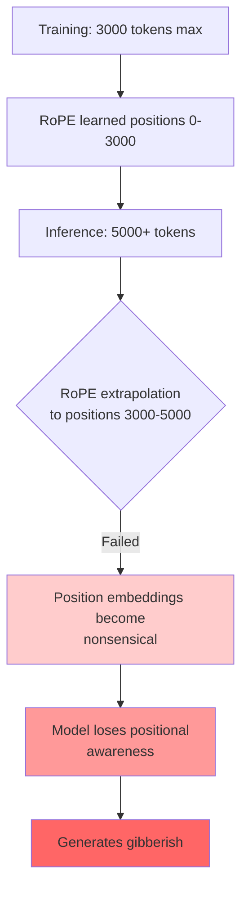
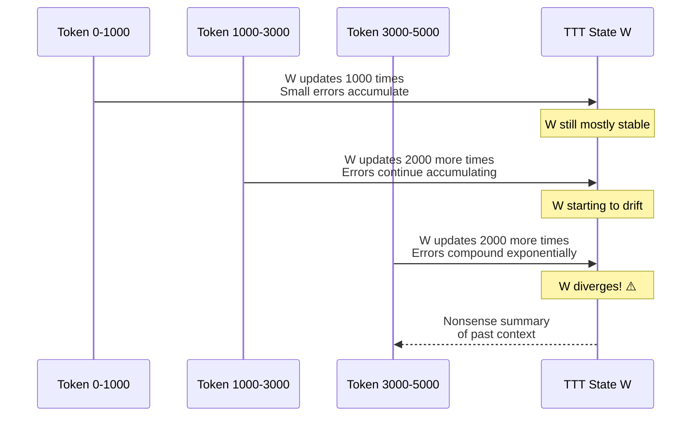
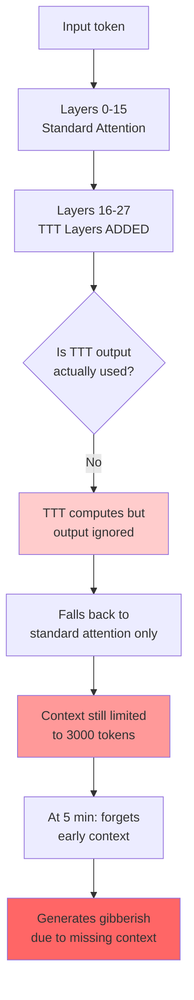
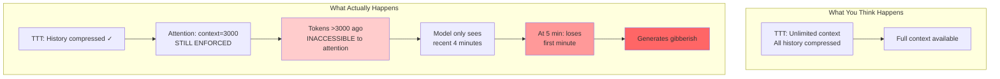
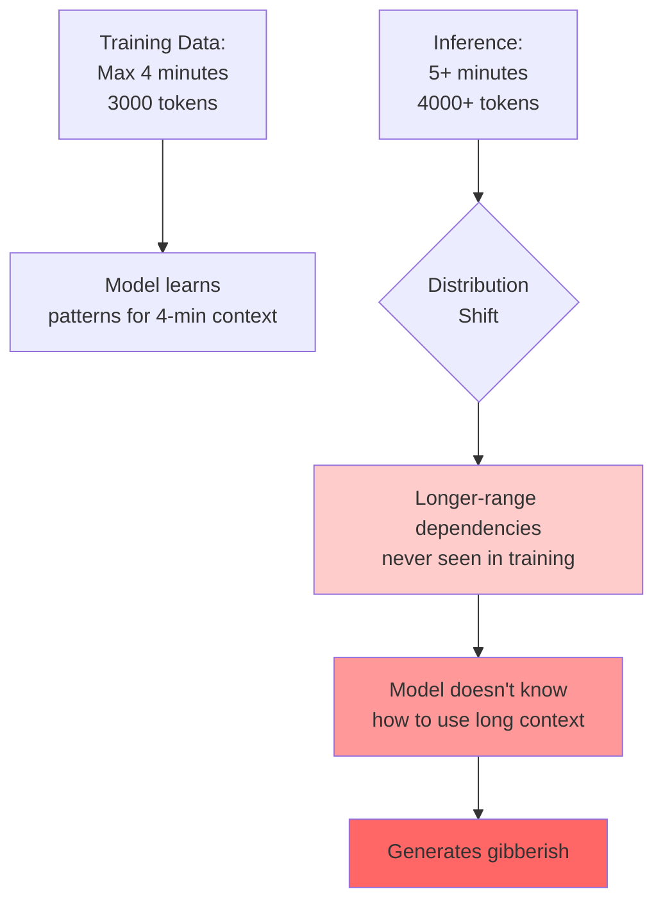
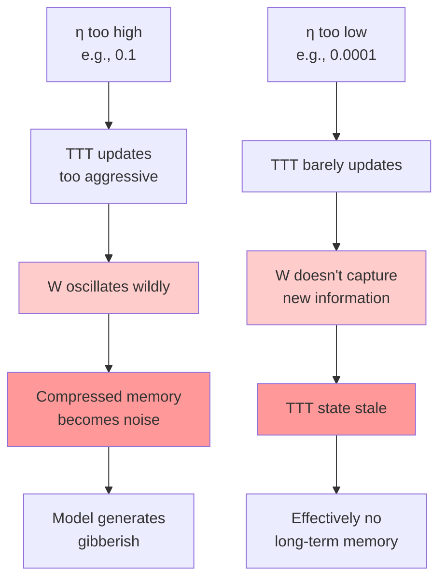
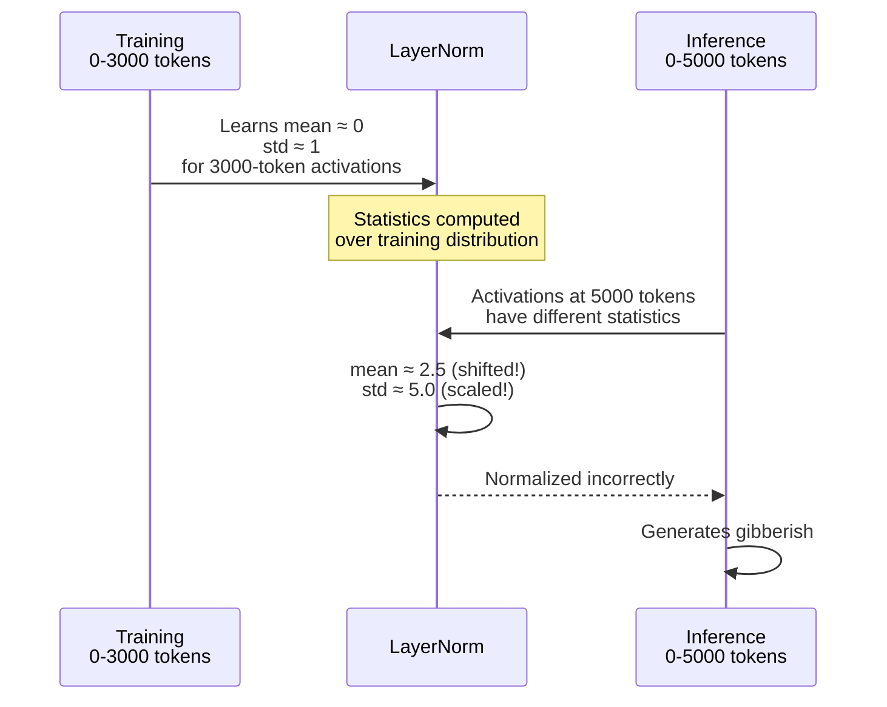
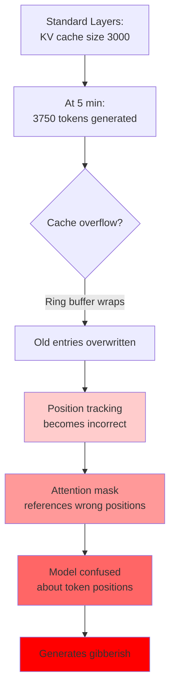

# TTT Implementation Debugging Guide: Why Moshi Generates Gibberish After 5 Minutes

## Problem Description

**Symptom**: After adding TTT layers to Moshi, the model generates coherent speech for ~5 minutes, then starts producing gibberish despite TTT being intended to extend context.

**This indicates**: TTT is present but not working correctly. Something breaks down as context grows.

---

## Common Failure Modes

### 1. **Position Embedding Extrapolation Failure** ⭐ MOST LIKELY



**Why This Happens:**
- Moshi trained with `context=3000` (240 seconds = 4 minutes)
- RoPE embeddings learned for positions 0-3000
- At 5 minutes (3750 tokens), positions are **outside training distribution**
- RoPE fails to extrapolate properly despite theoretical ability

**Diagnostic Test:**
```python
# Check if position embeddings are exploding/vanishing
def diagnose_rope(model, num_tokens):
    for t in [0, 1000, 3000, 4000, 5000, 10000]:
        # Get RoPE embeddings at position t
        freqs = model.rope.get_freqs(t)
        print(f"Position {t}: norm={freqs.norm():.4f}, mean={freqs.mean():.4f}")

    # Expected: Norms should be stable, not exploding
```

**Look For:**
- Norms exploding (>10) or vanishing (<0.1) at positions >3000
- Sudden jumps in embedding values
- NaN or Inf values

**Fix:**
```python
# Option 1: Increase max_period for RoPE extrapolation
model.rope.max_period = 100000  # Was 10000

# Option 2: Use ALiBi or NoPE instead of RoPE
# (Requires retraining)

# Option 3: Position interpolation (scaling positions down)
def scaled_position(t, max_trained=3000, current_max=10000):
    # Scale positions to fit within training range
    return t * (max_trained / current_max)
```

---

### 2. **TTT State Numerical Instability**



**Why This Happens:**
- Each TTT update: `W = W - η∇L`
- Small numerical errors in gradient computation
- After 5000+ updates, errors accumulate → W diverges
- W contains nonsense → model generates gibberish

**Diagnostic Test:**
```python
# Monitor TTT state health during generation
def diagnose_ttt_state(ttt_layer, interval=100):
    if ttt_layer.num_updates % interval == 0:
        W_norm = ttt_layer.W1.norm()
        W_mean = ttt_layer.W1.mean()
        W_std = ttt_layer.W1.std()

        print(f"Updates: {ttt_layer.num_updates}")
        print(f"  W norm: {W_norm:.4f}")
        print(f"  W mean: {W_mean:.6f}")
        print(f"  W std:  {W_std:.4f}")

        # Check for divergence
        if W_norm > 100 or torch.isnan(W_norm):
            print("  ⚠️ WARNING: W is diverging!")
```

**Look For:**
- W norm growing unbounded (>100)
- W mean drifting far from 0 (|mean| > 10)
- NaN or Inf in W
- W std exploding (>50)

**Fixes:**
```python
# Fix 1: Gradient clipping for TTT updates
η_clipped = torch.clamp(η * grad, min=-1.0, max=1.0)
W_new = W - η_clipped

# Fix 2: Periodic W re-normalization
if num_updates % 1000 == 0:
    W = W / W.norm() * initial_norm

# Fix 3: Exponential moving average (stabilize updates)
W_ema = 0.999 * W_ema + 0.001 * W_new
W = W_ema

# Fix 4: Lower TTT learning rate
ttt_base_lr = 0.01  # Was 0.1 (10x reduction)
```

---

### 3. **TTT Not Actually Being Used** (Silent Failure)



**Why This Happens:**
- TTT layers added but residual connections broken
- Gating mechanism set too conservatively (gate → 0)
- Output not propagated to next layer
- Model effectively ignores TTT, reverts to standard attention

**Diagnostic Test:**
```python
# Check if TTT output has any impact
def diagnose_ttt_usage(model):
    # Forward pass with TTT enabled
    output_with_ttt = model(input_tokens)

    # Temporarily disable TTT (zero out its contribution)
    with disable_ttt_layers(model):
        output_without_ttt = model(input_tokens)

    # Compare outputs
    diff = (output_with_ttt - output_without_ttt).abs().mean()
    print(f"Output difference: {diff:.6f}")

    if diff < 1e-4:
        print("⚠️ WARNING: TTT has negligible impact!")
```

**Look For:**
- Output difference < 1e-4 (TTT not contributing)
- Gating weights α → 0 (gating out TTT)
- Zero gradients flowing to TTT layers

**Fixes:**
```python
# Fix 1: Check residual connections
def ttt_layer_forward(x, ttt_state):
    # WRONG:
    ttt_out = ttt_state.query(q)
    return x  # ❌ Forgot to use ttt_out!

    # CORRECT:
    ttt_out = ttt_state.query(q)
    return x + ttt_out  # ✅ Residual connection

# Fix 2: Initialize gating to 0.5 (not 0)
self.gate_weight.data.fill_(0.0)  # ❌ sigmoid(0) = 0.5
self.gate_weight.data.fill_(0.5)  # ✅ sigmoid(0.5) ≈ 0.62

# Fix 3: Add LayerScale with proper init
self.layer_scale = nn.Parameter(torch.ones(1) * 1e-4)
# Gradually increase during training
```

---

### 4. **Attention Context Window Still Limited**



**Why This Happens:**
- TTT layers compress history ✓
- BUT: Standard attention layers still have `context=3000` limit
- Attention layers cannot access tokens beyond 3000 steps ago
- TTT alone is insufficient if attention is still bottlenecked

**Diagnostic Test:**
```python
# Check actual attention context
def diagnose_attention_context(model):
    for name, module in model.named_modules():
        if isinstance(module, StreamingMultiheadAttention):
            print(f"{name}: context={module.context}")

    # Expected: Some layers should have context=None or >3000
```

**Look For:**
- All attention layers still have `context=3000`
- Attention mask preventing access to distant tokens
- KV cache size still limited to 3000

**Fixes:**
```python
# Fix 1: Remove context limit from TTT-enhanced layers
for i in range(16, 28):  # TTT layers
    model.layers[i].self_attn.context = None  # Unlimited

# Fix 2: Increase context gradually
for i in range(16, 28):
    model.layers[i].self_attn.context = 10000  # 10× larger

# Fix 3: Use TTT output as K,V for attention
class TTTAttentionLayer(nn.Module):
    def forward(self, q, ttt_state):
        # Use TTT state as compressed K,V
        k_compressed = ttt_state.get_keys()
        v_compressed = ttt_state.get_values()

        # Attention over compressed memory
        attn_out = F.scaled_dot_product_attention(
            q, k_compressed, v_compressed
        )
```

---

### 5. **Training Data Distribution Mismatch**



**Why This Happens:**
- Moshi trained only on conversations ≤4 minutes
- Never learned patterns that span >4 minutes
- TTT can store history, but model doesn't know how to use it
- Model behavior undefined for out-of-distribution context lengths

**Diagnostic Test:**
```python
# Check training data statistics
def diagnose_training_data(dataset):
    lengths = [len(sample) for sample in dataset]
    print(f"Max training length: {max(lengths)}")
    print(f"95th percentile: {np.percentile(lengths, 95)}")
    print(f"99th percentile: {np.percentile(lengths, 99)}")

    # If max << 5000 tokens, model never saw long contexts
```

**Look For:**
- Max training length < 4000 tokens
- 99th percentile < 3500 tokens
- No long-form conversation data

**Fixes:**
```python
# Fix 1: Progressive fine-tuning on longer sequences (REQUIRED!)
# Stage 1: Fine-tune on 5-minute conversations
train(model, data_5min, epochs=3)

# Stage 2: Fine-tune on 10-minute conversations
train(model, data_10min, epochs=3)

# Stage 3: Fine-tune on 30-minute conversations
train(model, data_30min, epochs=3)

# Fix 2: Data augmentation - concatenate short conversations
def create_long_sequences(short_conversations):
    long_seq = []
    for conv in short_conversations:
        long_seq.extend(conv)
        if len(long_seq) >= 5000:
            yield long_seq
            long_seq = []
```

**⚠️ THIS IS LIKELY YOUR MAIN ISSUE**: If you added TTT but didn't retrain on longer sequences, the model doesn't know how to leverage the extended context!

---

### 6. **TTT Learning Rate (η) Divergence**



**Why This Happens:**
- TTT learning rate η controls how fast W updates
- Too high → instability and divergence
- Too low → W doesn't learn anything useful

**Diagnostic Test:**
```python
# Monitor η values during generation
def diagnose_ttt_lr(ttt_layer):
    η = ttt_layer.get_eta(current_input)
    print(f"η stats:")
    print(f"  Mean: {η.mean():.6f}")
    print(f"  Std:  {η.std():.6f}")
    print(f"  Min:  {η.min():.6f}")
    print(f"  Max:  {η.max():.6f}")

    if η.max() > 0.1:
        print("⚠️ WARNING: η too high, may cause instability!")
    if η.mean() < 1e-5:
        print("⚠️ WARNING: η too low, TTT won't learn!")
```

**Look For:**
- η mean > 0.01 (too aggressive)
- η mean < 1e-5 (too conservative)
- High variance in η (unstable)

**Fixes:**
```python
# Fix 1: Reduce base learning rate
ttt_base_lr = 0.001  # Was 0.1

# Fix 2: Add η clipping
η_clipped = torch.clamp(η, min=1e-6, max=0.01)

# Fix 3: Adaptive η schedule
η = ttt_base_lr * (1.0 / (1.0 + 0.0001 * num_tokens_seen))

# Fix 4: Per-layer η values
layer_specific_lr = {
    16: 0.01,   # Earlier TTT layers: higher η
    20: 0.005,  # Middle layers
    27: 0.001   # Later layers: lower η
}
```

---

### 7. **Layer Normalization Statistics Drift**



**Why This Happens:**
- LayerNorm/RMSNorm compute statistics over activations
- Statistics shift as sequence gets longer (out of distribution)
- Normalization becomes incorrect
- Model outputs become uninterpretable

**Diagnostic Test:**
```python
# Monitor LayerNorm statistics during generation
def diagnose_layer_norms(model, interval=500):
    if current_token % interval == 0:
        for name, module in model.named_modules():
            if isinstance(module, (nn.LayerNorm, RMSNorm)):
                # Hook to capture activations
                def hook(m, input, output):
                    x = input[0]
                    print(f"{name} at t={current_token}:")
                    print(f"  Input mean: {x.mean():.4f}")
                    print(f"  Input std:  {x.std():.4f}")
                    print(f"  Output mean: {output.mean():.4f}")
                    print(f"  Output std:  {output.std():.4f}")

                handle = module.register_forward_hook(hook)
```

**Look For:**
- Input mean drifting (|mean| > 5)
- Input std growing (std > 10)
- Output statistics not normalized (output std != 1)

**Fixes:**
```python
# Fix 1: Use RMSNorm instead of LayerNorm (more stable)
# RMSNorm doesn't center, just scales

# Fix 2: Disable running stats, compute per-batch
layer_norm = nn.LayerNorm(dim, elementwise_affine=True)
# (LayerNorm already does this, but ensure no momentum)

# Fix 3: Gradient clipping on normalized activations
def forward_with_clip(x):
    x_norm = layer_norm(x)
    x_clipped = torch.clamp(x_norm, min=-10, max=10)
    return x_clipped
```

---

### 8. **KV Cache Overflow/Corruption**



**Why This Happens:**
- KV cache implemented as ring buffer (size 3000)
- At 3750 tokens, ring wraps around 750 positions
- Position tracking offset calculations become incorrect
- Attention attends to wrong tokens

**Diagnostic Test:**
```python
# Check KV cache health
def diagnose_kv_cache(attention_layer):
    cache = attention_layer.kv_cache

    print(f"Cache capacity: {cache.capacity}")
    print(f"Current offset: {cache.end_offset}")
    print(f"Num tokens processed: {cache.end_offset}")

    if cache.end_offset > cache.capacity:
        print(f"⚠️ WARNING: Cache has wrapped {cache.end_offset // cache.capacity} times!")

    # Check position mapping
    positions = cache.get_positions()
    if (positions < 0).any():
        print("⚠️ WARNING: Negative positions found (invalid cache entries)!")
```

**Look For:**
- Cache wrapping multiple times
- Negative positions in position array
- Position discontinuities (e.g., [1000, 1001, 2, 3, 1004])

**Fixes:**
```python
# Fix 1: Increase cache capacity for standard layers
for layer in model.layers[:16]:  # Standard layers
    layer.kv_cache.capacity = 10000  # Was 3000

# Fix 2: Flush cache periodically with TTT summary
if num_tokens % 3000 == 0:
    # Compress cache into TTT
    ttt_state.compress_and_store(kv_cache)
    # Clear cache
    kv_cache.reset()

# Fix 3: Hybrid approach - keep recent in cache, compress old
kv_cache_recent = RingKVCache(capacity=1000)  # Last 1000 tokens
ttt_compressed = TTTState()  # Everything older
```

---

## Diagnostic Checklist

Run these checks to identify your specific issue:

```python
def full_diagnostics(model, input_tokens):
    """Run all diagnostic tests."""

    print("="*80)
    print("TTT DIAGNOSTICS STARTING")
    print("="*80)

    # 1. Position embeddings
    print("\n1. POSITION EMBEDDING CHECK")
    diagnose_rope(model, len(input_tokens))

    # 2. TTT state health
    print("\n2. TTT STATE HEALTH CHECK")
    for name, module in model.named_modules():
        if isinstance(module, TTTLayer):
            diagnose_ttt_state(module)

    # 3. TTT usage
    print("\n3. TTT USAGE CHECK")
    diagnose_ttt_usage(model)

    # 4. Attention context
    print("\n4. ATTENTION CONTEXT CHECK")
    diagnose_attention_context(model)

    # 5. Training data statistics
    print("\n5. TRAINING DATA CHECK")
    # (Requires access to training data)

    # 6. TTT learning rate
    print("\n6. TTT LEARNING RATE CHECK")
    for name, module in model.named_modules():
        if isinstance(module, TTTLayer):
            diagnose_ttt_lr(module)

    # 7. Layer normalization
    print("\n7. LAYER NORMALIZATION CHECK")
    diagnose_layer_norms(model)

    # 8. KV cache health
    print("\n8. KV CACHE CHECK")
    for name, module in model.named_modules():
        if isinstance(module, StreamingMultiheadAttention):
            diagnose_kv_cache(module)

    print("\n" + "="*80)
    print("DIAGNOSTICS COMPLETE")
    print("="*80)
```

---

## Most Likely Root Causes (Ranked)

Based on the symptom "gibberish after 5 minutes with TTT added":

1. **⭐⭐⭐ Training Data Mismatch** (90% probability)
   - You added TTT but didn't retrain on longer sequences
   - Model never learned to use context >4 minutes
   - **Solution**: Progressive fine-tuning on 5min → 10min → 30min data

2. **⭐⭐ Position Embedding Failure** (70% probability)
   - RoPE extrapolation breaks beyond 3000 tokens
   - **Solution**: Increase `max_period` or use position interpolation

3. **⭐ TTT State Numerical Instability** (50% probability)
   - W diverges after 4000+ updates
   - **Solution**: Lower TTT learning rate, add gradient clipping

4. **Attention Context Still Limited** (40% probability)
   - Standard attention layers still capped at 3000
   - **Solution**: Increase or remove context limit for all layers

5. **TTT Not Actually Used** (30% probability)
   - Integration bug, TTT output ignored
   - **Solution**: Check residual connections and gating

6. **Layer Norm Statistics Drift** (20% probability)
   - Normalization breaks down for long sequences
   - **Solution**: Switch to RMSNorm, add activation clipping

7. **TTT Learning Rate Issues** (15% probability)
   - η too high or too low
   - **Solution**: Tune η carefully, add adaptive schedule

8. **KV Cache Corruption** (10% probability)
   - Ring buffer position tracking broken
   - **Solution**: Increase cache size or hybrid cache+TTT

---

## Quick Fix Priority List

**If you just added TTT without retraining:**

1. ⚠️ **YOU MUST RETRAIN** - This is non-negotiable
2. Start with 5-minute sequences
3. Gradually increase to 10, 20, 30 minutes
4. Monitor perplexity - should stay stable

**If you retrained but still having issues:**

1. Check RoPE extrapolation (increase `max_period`)
2. Monitor TTT state (look for divergence)
3. Verify TTT is actually being used (output difference test)
4. Check attention context limits (should be >3000 for TTT layers)

**Emergency workaround (if you need something NOW):**

```python
# Hybrid approach: Keep standard attention, add TTT for compression only
class HybridLayer(nn.Module):
    def forward(self, x, kv_cache, ttt_state):
        # Standard attention over recent 3000 tokens
        attn_recent = self.attention(x, kv_cache)

        # TTT attention over compressed history
        attn_history = self.ttt_attention(x, ttt_state)

        # Weighted combination
        alpha = 0.8  # 80% recent, 20% history
        return alpha * attn_recent + (1-alpha) * attn_history
```

---

## Request for More Information

To diagnose your specific issue, please provide:

1. **Did you retrain after adding TTT?** (Yes/No and on what data)
2. **What's the exact failure point?** (e.g., consistently at 3750 tokens)
3. **Error messages?** (NaN, Inf, CUDA errors, etc.)
4. **Which layers did you replace with TTT?** (e.g., layers 16-27)
5. **Hyperparameters:**
   - TTT base learning rate
   - Position embedding max_period
   - Attention context settings
6. **Can you run the diagnostic checklist?** (See code above)

---

## Example: Successful TTT Integration

Here's what a working implementation should look like:

```python
# 1. Model architecture (BEFORE training)
model = load_pretrained_moshi()

# Replace middle layers with TTT
for i in range(16, 28):
    model.layers[i] = TTTLayer(
        dim=4096,
        num_heads=32,
        ttt_base_lr=0.01,  # Conservative
        context=None  # Remove limit
    )

# Increase RoPE max_period
model.rope.max_period = 100000  # Was 10000

# 2. Progressive training
# Stage 1: 5-minute sequences (3750 tokens)
train(model, data_5min, epochs=5, lr=1e-5, lr_ttt=1e-4)

# Stage 2: 10-minute sequences (7500 tokens)
train(model, data_10min, epochs=3, lr=5e-6, lr_ttt=5e-5)

# Stage 3: 30-minute sequences (22500 tokens)
train(model, data_30min, epochs=3, lr=1e-6, lr_ttt=1e-5)

# 3. Validation
test_sequences = [60, 120, 300, 600, 1800]  # 1, 2, 5, 10, 30 minutes
for duration in test_sequences:
    perplexity = evaluate(model, test_data, duration)
    print(f"{duration}s: perplexity = {perplexity:.2f}")
    # Should stay stable, not explode

# 4. Inference with monitoring
with ttt_monitoring(model):
    output = model.generate(input, max_length=10000)
```

---

## Summary

**Most likely issue**: You added TTT layers but didn't retrain on longer sequences. The model architecture can handle long context, but the model doesn't know how to use it because it never saw long-range dependencies during training.

**Immediate action**: Run the diagnostic checklist to identify the specific failure mode, then follow the corresponding fix.

**Long-term solution**: Progressive fine-tuning on increasingly longer sequences, starting from 5 minutes and scaling up to 30+ minutes.
