# TTT-Video-DIT Architecture Analysis

## Complete Analysis of 3-Second Segmentation with Global TTT Layers

---

## Table of Contents
1. [Overview](#overview)
2. [3-Second Segmentation Architecture](#3-second-segmentation-architecture)
3. [Attention Mechanism: Local Segment Processing](#attention-mechanism-local-segment-processing)
4. [TTT Layers: Global Sequential Processing](#ttt-layers-global-sequential-processing)
5. [Combined Architecture Flow](#combined-architecture-flow)
6. [Training Pipeline](#training-pipeline)
7. [Data Loading and Processing](#data-loading-and-processing)
8. [Key Implementation Details](#key-implementation-details)

---

## Overview

The TTT-Video-DIT architecture elegantly combines **local attention** on 3-second video segments with **global TTT (Test-Time Training) layers** that process the entire sequence. This hybrid approach enables efficient long-form video generation while maintaining temporal coherence across the full sequence.

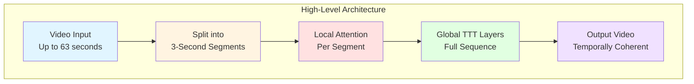

### Key Design Principles

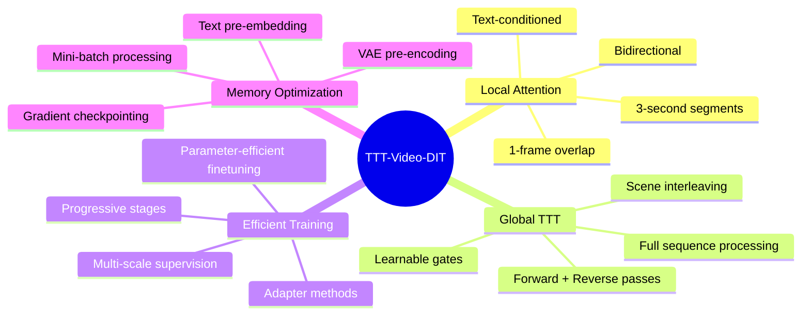

---

## 3-Second Segmentation Architecture

### Video Segment Breakdown

The architecture fundamentally operates on 3-second video segments, which are then concatenated for longer videos.

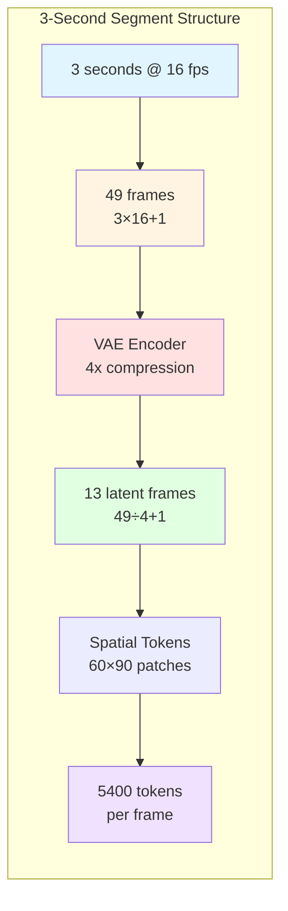

### Multi-Duration Video Composition

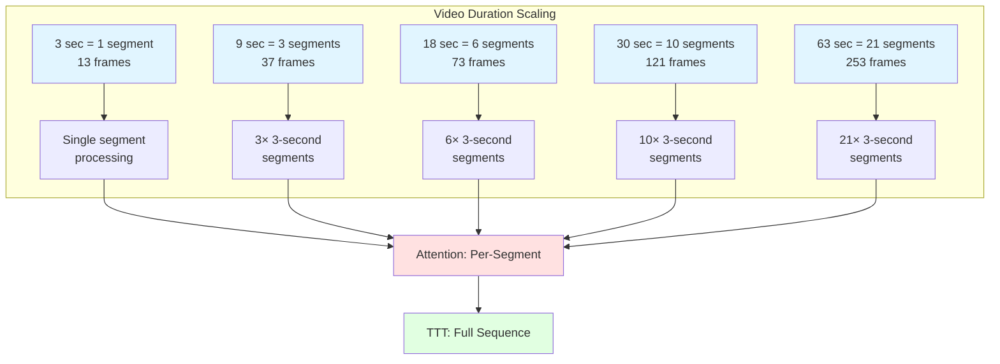

### Frame and Token Calculations

```mermaid
graph TD
    subgraph "Frame Calculations"
        A[Duration in seconds] --> B{Calculate Raw Frames}
        B --> C[frames = duration × 16 + 1]
        C --> D{VAE Compression}
        D --> E[latent_frames = raw_frames ÷ 4 + 1]
        E --> F{Spatial Tokenization}
        F --> G[tokens = latent_frames × 60 × 90]
    end

    subgraph "Example: 3 seconds"
        H[3 seconds] --> I[49 raw frames]
        I --> J[13 latent frames]
        J --> K[70,200 total tokens]
    end

    subgraph "Example: 63 seconds"
        L[63 seconds] --> M[1009 raw frames]
        M --> N[253 latent frames]
        N --> O[1,366,200 total tokens]
    end

    style A fill:#e1f5ff
    style H fill:#fff4e1
    style L fill:#ffe1e1
```

---

## Attention Mechanism: Local Segment Processing

### Attention Processing Pipeline

The attention mechanism operates **locally** on each 3-second segment with a small overlap for temporal continuity.

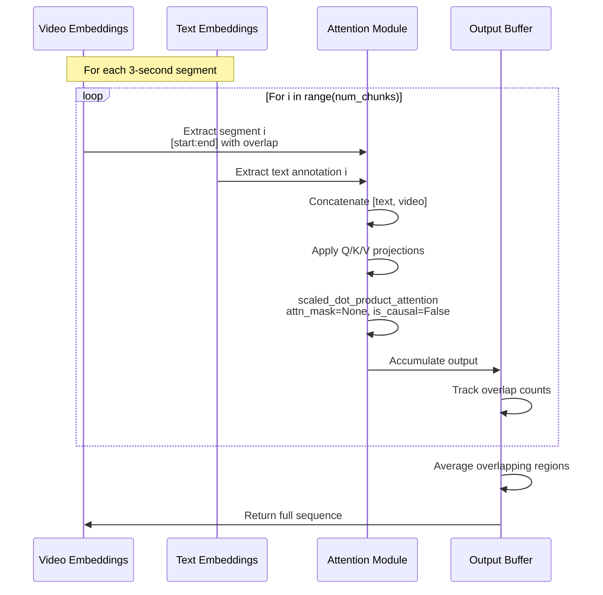

### Attention Segment Overlap Strategy

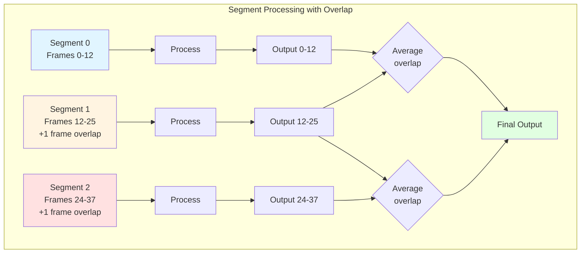

### Attention Configuration

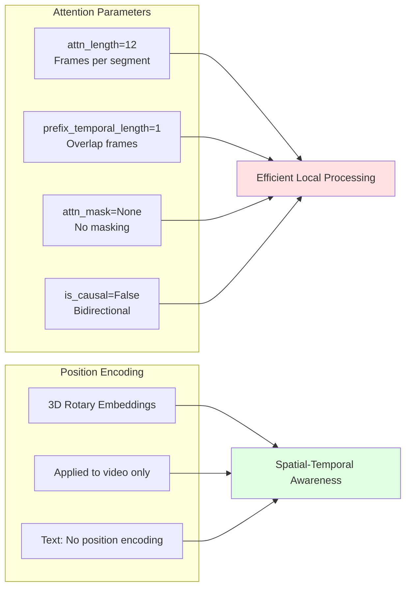

### Detailed Attention Forward Pass

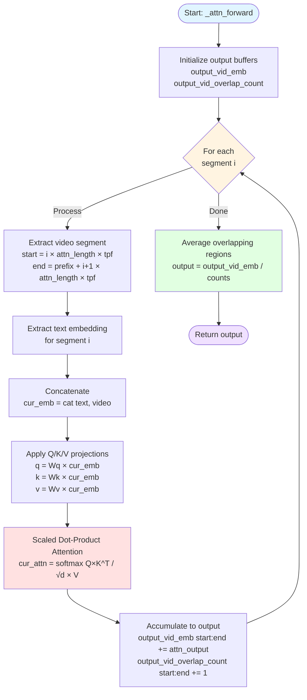

---

## TTT Layers: Global Sequential Processing

### TTT Architecture Overview

TTT (Test-Time Training) layers process the **entire video sequence** (all concatenated segments) in both forward and reverse directions, providing global temporal context.

```mermaid
graph TB
    subgraph "TTT Layer Architecture"
        A[Full Sequence Input<br/>All segments concatenated] --> B[Text + Video Embeddings]

        B --> C[Forward TTT Pass]
        C --> D[Forward Gating]
        D --> E[Residual Connection 1]

        E --> F[Flip Video Sequence]
        F --> G[Reverse TTT Pass]
        G --> H[Flip Back]
        H --> I[Backward Gating]
        I --> J[Residual Connection 2]

        J --> K[Output:<br/>Globally contextualized]
    end

    style A fill:#e1f5ff
    style C fill:#ffe1e1
    style G fill:#ffe1e1
    style K fill:#e1ffe1
```

### Forward and Reverse Processing

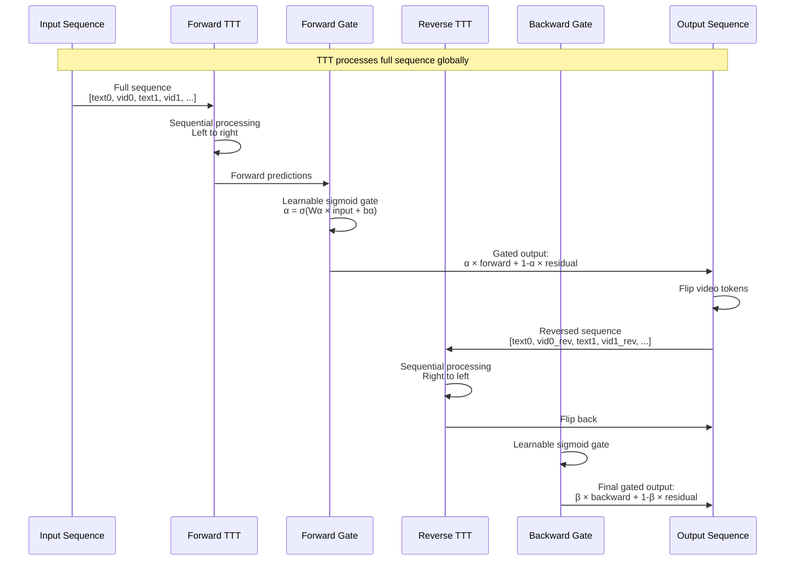

### TTT Mini-Batch Processing

TTT layers use mini-batch processing for memory efficiency when handling long sequences.

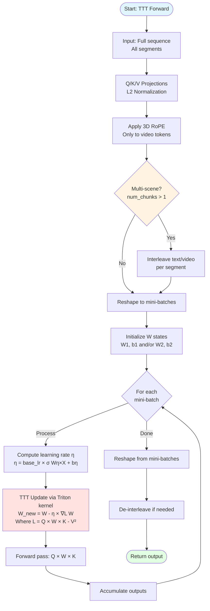

### TTT Learnable Components

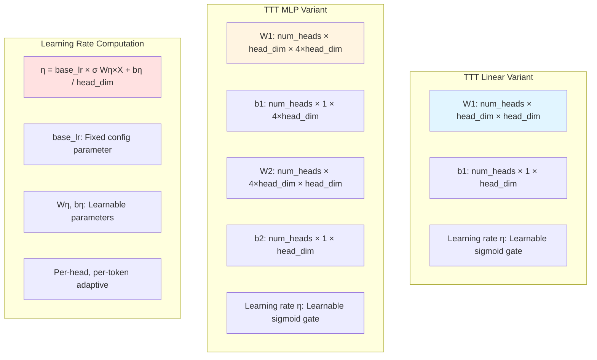

### Scene Interleaving for Multi-Segment Videos

When processing videos longer than 3 seconds, TTT layers use scene interleaving to maintain segment boundaries while processing globally.

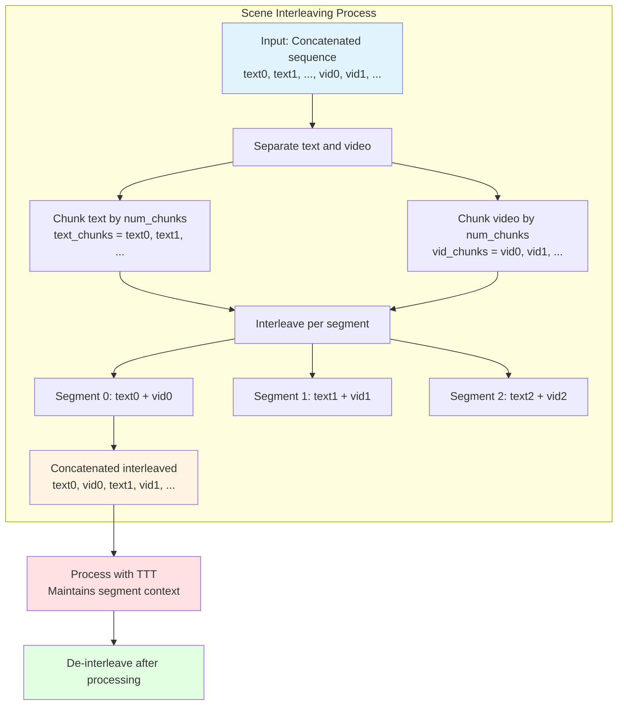

### TTT Update Mechanism

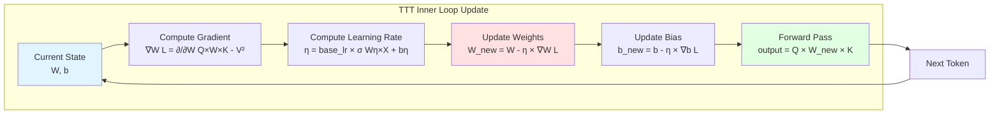

---

## Combined Architecture Flow

### Complete Forward Pass

This diagram shows how attention and TTT layers work together in a single DiT block.

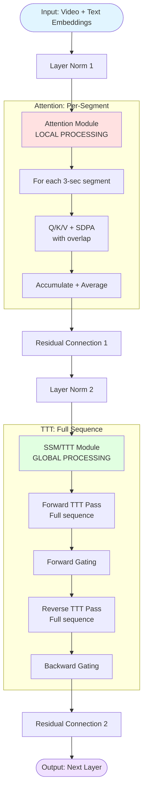

### Multi-Layer Architecture

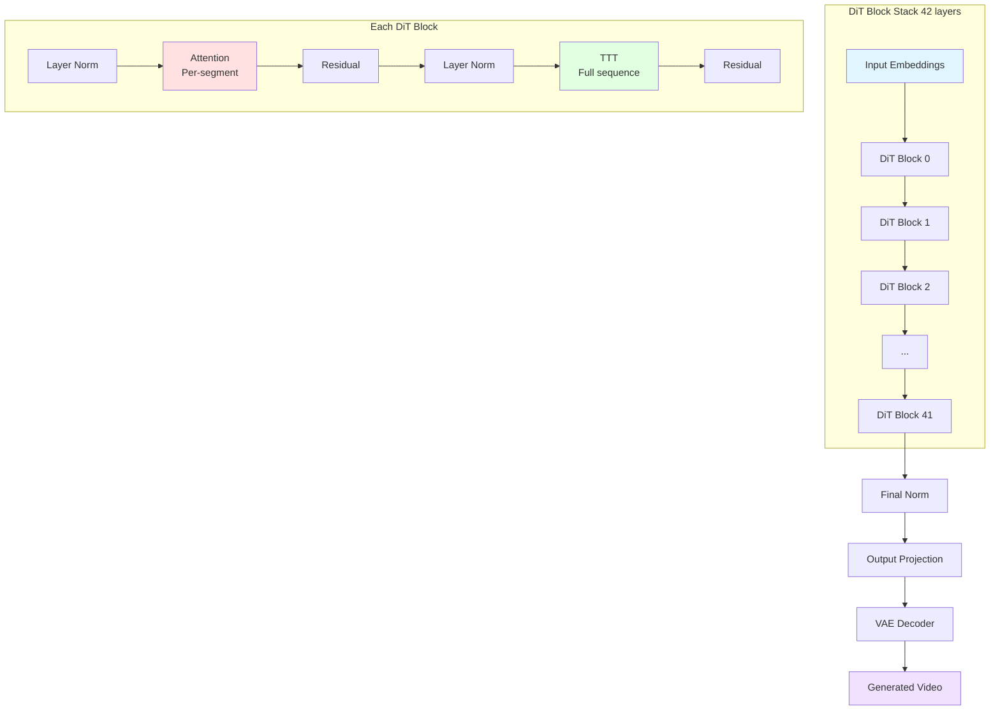

### Attention vs TTT: Scope Comparison

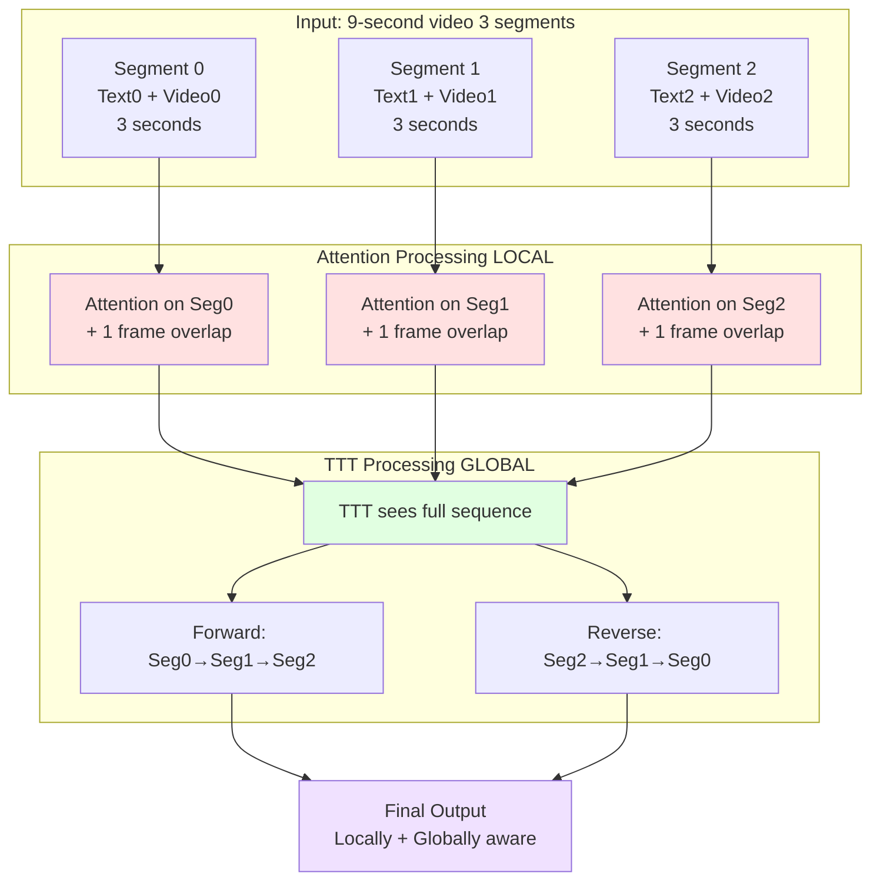

### Information Flow Timeline

```mermaid
gantt
    title Token Processing Timeline: Attention vs TTT
    dateFormat X
    axisFormat %s

    section Attention
    Process Segment 0 :a1, 0, 3
    Process Segment 1 :a2, 3, 6
    Process Segment 2 :a3, 6, 9

    section TTT Forward
    Process Full Sequence :t1, 0, 9

    section TTT Reverse
    Process Full Sequence Rev :t2, 0, 9

    section Output
    Combined Result :o1, 0, 9
```

---

## Training Pipeline

### Progressive Training Strategy

The model is trained progressively from 3 seconds to 63 seconds, with different parameter update strategies at each stage.

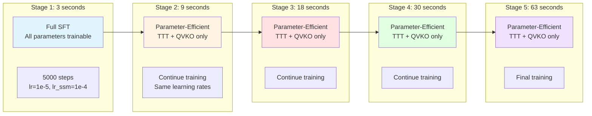

### Training Configuration Details

```mermaid
graph TB
    subgraph "Model Configuration"
        A[Model Size: 5B parameters]
        B[Model Dim: 3072]
        C[Num Heads: 48]
        D[Num Layers: 42]
        E[SSM Layer: ttt_mlp]
    end

    subgraph "Training Hyperparameters"
        F[Global Batch Size: 64]
        G[Gradient Accumulation: 1]
        H[Warmup Steps: 100]
        I[Total Steps: 5000 per stage]
    end

    subgraph "Optimizer Configuration"
        J[Base LR: 1e-5]
        K[SSM LR: 1e-4 10×]
        L[TTT Base LR: 0.1]
        M[Optimizer: AdamW]
    end

    subgraph "Adapter Method"
        N[Stage 1: Full SFT]
        O[Stages 2-5: QVKO + TTT only]
    end

    style A fill:#e1f5ff
    style F fill:#fff4e1
    style J fill:#ffe1e1
    style N fill:#e1ffe1
```

### Parameter Update Strategy

```mermaid
flowchart TD
    Start([Training Stage]) --> Stage{Which Stage?}

    Stage -->|Stage 1<br/>3 sec| FullSFT[Full Supervised Fine-Tuning]
    Stage -->|Stages 2-5<br/>9-63 sec| PartialUpdate[Parameter-Efficient Fine-Tuning]

    FullSFT --> UpdateAll[Update ALL parameters:<br/>- Attention Q/K/V/O<br/>- TTT W1/W2/b1/b2/η<br/>- Layer norms<br/>- Output projections]

    PartialUpdate --> UpdatePartial[Update ONLY:<br/>- TTT parameters W1/W2/b1/b2/η<br/>- Attention Q/K/V/O projections]

    UpdateAll --> Compute[Compute Gradients]
    UpdatePartial --> Compute

    Compute --> OptStep[Optimizer Step<br/>AdamW with differential LRs]

    OptStep --> LRDiff{Apply Learning Rates}

    LRDiff --> BaseLR[Base params: 1e-5]
    LRDiff --> SSMLR[SSM/TTT params: 1e-4]

    BaseLR --> End([Continue Training])
    SSMLR --> End

    style Start fill:#e1f5ff
    style FullSFT fill:#fff4e1
    style PartialUpdate fill:#ffe1e1
    style End fill:#e1ffe1
```

### Training Loss Computation

```mermaid
sequenceDiagram
    participant Data as Training Batch
    participant Model as DiT Model
    participant Loss as Loss Function
    participant Opt as Optimizer

    Data->>Model: video_emb, text_emb<br/>seq_metadata, timestep

    Model->>Model: Add noise to video_emb<br/>according to timestep

    Model->>Model: Process through DiT blocks<br/>Attention + TTT layers

    Model->>Model: Predict noise

    Model->>Loss: predicted_noise, true_noise

    Loss->>Loss: Compute MSE Loss<br/>L = predicted_noise - true_noise²

    Loss->>Opt: Backpropagate gradients

    Opt->>Opt: Update parameters<br/>With differential learning rates

    Opt->>Model: Updated weights
```

---

## Data Loading and Processing

### Dataset Preparation Pipeline

```mermaid
flowchart TD
    Start([Raw Video Dataset]) --> Split[Split into scenes<br/>Multiples of 3 seconds]

    Split --> Segment[Segment each scene<br/>into 3-second chunks]

    Segment --> Annotate[Create text annotation<br/>per 3-second segment]

    Annotate --> VAE[VAE Encode video<br/>Process in 1-sec chunks]

    VAE --> SaveVid[Save VAE latents<br/>vid_emb.pt files]

    Annotate --> TextEmbed[Generate text embeddings<br/>Using T5/CLIP encoder]

    TextEmbed --> SaveTxt[Save text embeddings<br/>text_chunk_emb_*.pt]

    SaveVid --> JSON[Create JSONL metadata]
    SaveTxt --> JSON

    JSON --> Dataset[PreembeddingDataset<br/>Ready for training]

    style Start fill:#e1f5ff
    style VAE fill:#ffe1e1
    style TextEmbed fill:#ffe1e1
    style Dataset fill:#e1ffe1
```

### JSONL Metadata Structure

```mermaid
classDiagram
    class MetadataEntry {
        +string scene_id
        +int num_chunks
        +string vid_emb : Path to VAE latents
        +List~string~ text_chunk_emb : Paths to text embeddings
        +int video_length : Total frames
        +int num_frames : Latent frames
    }

    class VideoEmbedding {
        +Tensor mean : VAE mean
        +Tensor logvar : VAE log variance
        +Shape [C, T, H, W]
    }

    class TextEmbedding {
        +Tensor embedding
        +Shape [seq_len, embed_dim]
        +int seq_len : 226 tokens
    }

    MetadataEntry --> VideoEmbedding : vid_emb path
    MetadataEntry --> TextEmbedding : text_chunk_emb paths
```

### Data Loading During Training

```mermaid
sequenceDiagram
    participant DL as DataLoader
    participant DS as PreembeddingDataset
    participant Disk as Disk Storage
    participant Batch as Batch Processor

    DL->>DS: Request batch indices

    loop For each index in batch
        DS->>Disk: Load vid_emb.pt
        Disk->>DS: VAE latents mean, logvar
        DS->>DS: Sample from VAE distribution<br/>z = μ + ε × exp σ/2

        DS->>Disk: Load text_chunk_emb_*.pt
        Disk->>DS: Text embeddings per segment

        DS->>DS: Stack text embeddings<br/>[num_chunks, seq_len, dim]
    end

    DS->>Batch: Collated samples

    Batch->>Batch: Text dropout 10%<br/>Randomly zero some segments

    Batch->>Batch: Create SequenceMetadata<br/>num_chunks, num_frames, etc.

    Batch->>DL: Ready batch
```

### VAE Encoding Process

```mermaid
graph TD
    subgraph "VAE Pre-Encoding"
        A[Raw video 49 frames] --> B[Split into 1-sec chunks<br/>To avoid OOM]
        B --> C[Chunk 0: frames 0-16]
        B --> D[Chunk 1: frames 16-32]
        B --> E[Chunk 2: frames 32-48]

        C --> F[VAE Encode chunk 0]
        D --> G[VAE Encode chunk 1]
        E --> H[VAE Encode chunk 2]

        F --> I[Latent chunk 0: 4 frames]
        G --> J[Latent chunk 1: 4 frames]
        H --> K[Latent chunk 2: 4 frames]

        I --> L[Concatenate latents]
        J --> L
        K --> L

        L --> M[Full latent: 13 frames<br/>mean + logvar]
    end

    M --> N[Save to disk: vid_emb.pt]

    style A fill:#e1f5ff
    style F fill:#ffe1e1
    style M fill:#e1ffe1
    style N fill:#f0e1ff
```

### Text Embedding Pre-computation

```mermaid
flowchart LR
    subgraph "Text Processing"
        A[Text annotations<br/>One per 3-sec segment] --> B[Tokenization]
        B --> C[T5 or CLIP Encoder]
        C --> D[Text Embeddings<br/>[226, 4096]]
    end

    subgraph "Per Segment"
        D --> E1[Segment 0 embedding]
        D --> E2[Segment 1 embedding]
        D --> E3[Segment 2 embedding]
    end

    E1 --> F[Save text_chunk_emb_0.pt]
    E2 --> G[Save text_chunk_emb_1.pt]
    E3 --> H[Save text_chunk_emb_2.pt]

    F --> I[Reference in JSONL]
    G --> I
    H --> I

    style A fill:#e1f5ff
    style C fill:#ffe1e1
    style I fill:#e1ffe1
```

---

## Key Implementation Details

### SequenceMetadata Dataclass

The `SequenceMetadata` object carries essential information about the video sequence structure throughout the forward pass.

```mermaid
classDiagram
    class SequenceMetadata {
        +int text_length : Tokens per annotation
        +int seq_text_length : Total text tokens
        +int num_frames : Total video frames
        +int num_chunks : Number of 3-sec segments
        +int tokens_per_frame : Spatial tokens
        +int latent_height : 60
        +int latent_width : 90
        +Tensor t_emb : Timestep embedding
        +Optional~int~ base_offset : Frames per chunk
        +Optional~int~ init_offset : Frames in first chunk
        +bool is_multiscene : num_chunks > 1
    }

    class Example3Sec {
        text_length: 226
        seq_text_length: 226
        num_frames: 13
        num_chunks: 1
        tokens_per_frame: 5400
        is_multiscene: False
    }

    class Example9Sec {
        text_length: 226
        seq_text_length: 678
        num_frames: 37
        num_chunks: 3
        tokens_per_frame: 5400
        is_multiscene: True
    }

    SequenceMetadata <|-- Example3Sec
    SequenceMetadata <|-- Example9Sec
```

### Interleave Offset Calculation

```mermaid
graph TD
    A[Input: num_frames, num_chunks] --> B[Calculate frames per chunk<br/>frames_per_chunk = num_frames // num_chunks]

    B --> C[Calculate base offset<br/>base_offset = frames_per_chunk × tokens_per_frame + text_length]

    B --> D[Calculate remainder<br/>remainder = num_frames % num_chunks]

    D --> E[Calculate init offset<br/>init_offset = frames_per_chunk + remainder × tokens_per_frame + text_length]

    C --> F[Use base_offset for chunks 1 to n-1]
    E --> G[Use init_offset for chunk 0]

    style A fill:#e1f5ff
    style C fill:#fff4e1
    style E fill:#ffe1e1
    style F fill:#e1ffe1
    style G fill:#e1ffe1
```

### Gating Mechanism

The model uses learnable sigmoid gates to blend TTT predictions with residual connections.

```mermaid
graph TB
    subgraph "Gating Computation"
        A[Input x] --> B[Text portion x_text]
        A --> C[Video portion x_video]

        B --> D[Text gate:<br/>α_text = σ W_text × x_text + b_text]
        C --> E[Video gate:<br/>α_video = σ W_video × x_video + b_video]

        D --> F[Gated text:<br/>y_text = α_text × ttt_out + 1-α_text × residual]
        E --> G[Gated video:<br/>y_video = α_video × ttt_out + 1-α_video × residual]

        F --> H[Concatenate:<br/>y = y_text, y_video]
    end

    style A fill:#e1f5ff
    style D fill:#ffe1e1
    style E fill:#ffe1e1
    style H fill:#e1ffe1
```

### 3D Rotary Position Embeddings

```mermaid
flowchart TD
    Start([Input: Video Tokens]) --> Reshape[Reshape to<br/> B, T, H, W, D]

    Reshape --> CreateFreqs[Create frequency grids<br/>freq_t, freq_h, freq_w]

    CreateFreqs --> Temporal[Temporal frequencies<br/>Based on frame index]
    CreateFreqs --> Height[Height frequencies<br/>Based on patch row]
    CreateFreqs --> Width[Width frequencies<br/>Based on patch column]

    Temporal --> Combine[Combine frequencies<br/>freqs_cis = e^i×freq_t+freq_h+freq_w]
    Height --> Combine
    Width --> Combine

    Combine --> ApplyQ[Apply to Q:<br/>Q_rope = Q × freqs_cis]
    Combine --> ApplyK[Apply to K:<br/>K_rope = K × freqs_cis]

    ApplyQ --> Output[Output: Position-aware Q, K]
    ApplyK --> Output

    style Start fill:#e1f5ff
    style Combine fill:#ffe1e1
    style Output fill:#e1ffe1
```

### Memory Optimization: Mini-Batch Processing

To handle long sequences efficiently, TTT layers process tokens in mini-batches.

```mermaid
graph TB
    subgraph "Mini-Batch Configuration"
        A[Full Sequence:<br/>B × L × D] --> B[Chunk into mini-batches<br/>MB = checkpoint_group_size]
        B --> C[Mini-batch 0:<br/>B × MB × D]
        B --> D[Mini-batch 1:<br/>B × MB × D]
        B --> E[Mini-batch K:<br/>B × remaining × D]
    end

    subgraph "Sequential Processing"
        C --> F[Process MB0 with TTT<br/>Update W states]
        F --> G[Process MB1 with TTT<br/>Update W states]
        G --> H[Process MBK with TTT<br/>Update W states]
    end

    H --> I[Concatenate outputs<br/>B × L × D]

    I --> J[Gradient Checkpointing<br/>Recompute on backward pass]

    style A fill:#e1f5ff
    style F fill:#ffe1e1
    style I fill:#e1ffe1
    style J fill:#f0e1ff
```

### Triton Kernel for TTT Updates

The TTT update is implemented as a custom Triton kernel for efficiency.

```mermaid
sequenceDiagram
    participant CPU as CPU Host
    participant GPU as GPU Memory
    participant Kernel as Triton Kernel

    CPU->>GPU: Transfer W, b states
    CPU->>GPU: Transfer XQ, XK, XV
    CPU->>GPU: Transfer η learning rates

    GPU->>Kernel: Launch TritonLinear.apply

    loop For each token in mini-batch
        Kernel->>Kernel: Compute gradient<br/>∇W = K^T × Q×W×K - V
        Kernel->>Kernel: Update W<br/>W -= η × ∇W
        Kernel->>Kernel: Forward pass<br/>output = Q × W × K
    end

    Kernel->>GPU: Write outputs
    GPU->>CPU: Return results
```

---

## Architecture Comparison Table

### Attention vs TTT Layers

| Property | Attention Layers | TTT Layers |
|----------|------------------|------------|
| **Scope** | Local (per 3-sec segment + overlap) | Global (full sequence) |
| **Computation** | Parallel within segment | Sequential across sequence |
| **Direction** | Bidirectional (non-causal) | Forward + Reverse (bidirectional) |
| **Memory** | O(L² × d) per segment | O(L × d²) for full sequence |
| **Context** | 12 frames + 1 overlap ≈ 0.81 sec | All frames (up to 63 sec) |
| **Parameters** | Q/K/V/O projection matrices | W1/W2/b1/b2 + learnable η gates |
| **Update** | Fixed projections (gradient descent) | Dynamic W states (test-time training) |
| **Position Encoding** | 3D RoPE on video tokens | Implicit via sequential processing |
| **Masking** | None (full attention in segment) | Causal (forward), Anti-causal (reverse) |
| **Training Stage 1** | All parameters updated | All parameters updated |
| **Training Stages 2-5** | Only Q/K/V/O updated | All TTT parameters updated |

### Model Size Configurations

| Size | Model Dim | Num Heads | Head Dim | Num Layers | Total Params |
|------|-----------|-----------|----------|------------|--------------|
| **2B** | 1920 | 30 | 64 | 30 | ~2 billion |
| **5B** | 3072 | 48 | 64 | 42 | ~5 billion |

### Video Duration Specifications

| Duration | Raw Frames | Latent Frames | Num Chunks | Total Tokens | Training Stage |
|----------|-----------|---------------|------------|--------------|----------------|
| **3 sec** | 49 | 13 | 1 | 70,200 | Stage 1 (Full SFT) |
| **9 sec** | 145 | 37 | 3 | 199,800 | Stage 2 (QVKO + TTT) |
| **18 sec** | 289 | 73 | 6 | 394,200 | Stage 3 (QVKO + TTT) |
| **30 sec** | 481 | 121 | 10 | 653,400 | Stage 4 (QVKO + TTT) |
| **63 sec** | 1009 | 253 | 21 | 1,366,200 | Stage 5 (QVKO + TTT) |

---

## Summary: Key Insights

```mermaid
mindmap
    root((TTT-Video-DIT<br/>Architecture))
        Hybrid Design
            Local attention efficiency
            Global TTT coherence
            Best of both worlds
        3-Second Segmentation
            Fundamental unit
            Text per segment
            VAE compressed
            Concatenated for longer
        Attention: Per-Segment
            12 frames processed
            1 frame overlap
            No masking
            Parallel efficient
        TTT: Full-Sequence
            Forward pass
            Reverse pass
            Scene interleaving
            Learnable gates
        Progressive Training
            3s full SFT
            9-63s parameter efficient
            Differential learning rates
            TTT lr 10x higher
        Memory Optimizations
            Mini-batch processing
            Gradient checkpointing
            VAE pre-encoding
            Text pre-embedding
        Learnable Components
            TTT W1 W2 matrices
            Learnable lr gates
            Gating mechanisms
            3D RoPE embeddings
```

---

## File References

### Core Implementation Files

| File | Purpose | Key Components |
|------|---------|----------------|
| `ttt/models/cogvideo/dit.py` | Main DiT architecture | `_attn_forward`, `_ssm_forward`, `CogVideoXTransformer3DModel` |
| `ttt/models/ssm/ttt_layer.py` | TTT layer implementations | `TTTLinear`, `TTTMLP`, `TTTBase`, Triton kernels |
| `ttt/models/configs.py` | Model configurations | `CogVideoXConfig`, size variants, layer configs |
| `ttt/models/cogvideo/utils.py` | Utility functions | `SequenceMetadata`, `get_interleave_offsets` |
| `ttt/datasets/preembedding_dataset.py` | Data loading | `PreembeddingDataset`, VAE sampling |
| `data/precomp_video.py` | Data preprocessing | VAE encoding, text embedding generation |
| `train.py` | Training loop | Loss computation, optimizer, gradient accumulation |

### Configuration Files

| File | Purpose |
|------|---------|
| `configs/train/ttt-mlp/3s.toml` | 3-second training config (Stage 1) |
| `configs/train/ttt-mlp/9s.toml` | 9-second training config (Stage 2) |
| `configs/train/ttt-mlp/18s.toml` | 18-second training config (Stage 3) |
| `configs/train/ttt-mlp/30s.toml` | 30-second training config (Stage 4) |
| `configs/train/ttt-mlp/63s.toml` | 63-second training config (Stage 5) |

### Documentation Files

| File | Purpose |
|------|---------|
| `README.md` | Overview and quick start |
| `docs/dataset.md` | Dataset preparation guide |
| `docs/training.md` | Training procedures and stages |

---

## Conclusion

The TTT-Video-DIT architecture successfully addresses the challenge of long-form video generation through an elegant hybrid approach:

1. **Local Attention**: Efficient processing of 3-second segments with overlap ensures computational tractability while maintaining local temporal coherence.

2. **Global TTT Layers**: Sequential processing of the full concatenated sequence (forward and reverse) provides global temporal context and long-range dependencies.

3. **Progressive Training**: Starting from 3-second videos and progressively extending to 63 seconds with parameter-efficient fine-tuning enables efficient learning of temporal dynamics at multiple scales.

4. **Memory Optimizations**: Mini-batch processing, gradient checkpointing, and pre-encoded embeddings make training feasible on long sequences.

This design allows the model to generate temporally coherent videos up to 63 seconds long while maintaining high quality and computational efficiency.

---

**Document Version**: 1.0
**Last Updated**: 2025-11-10
**Repository**: claude-web/ttt-video-dit
