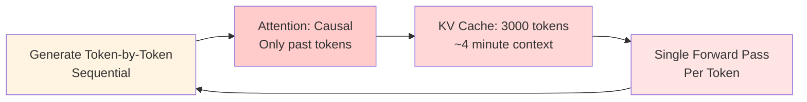
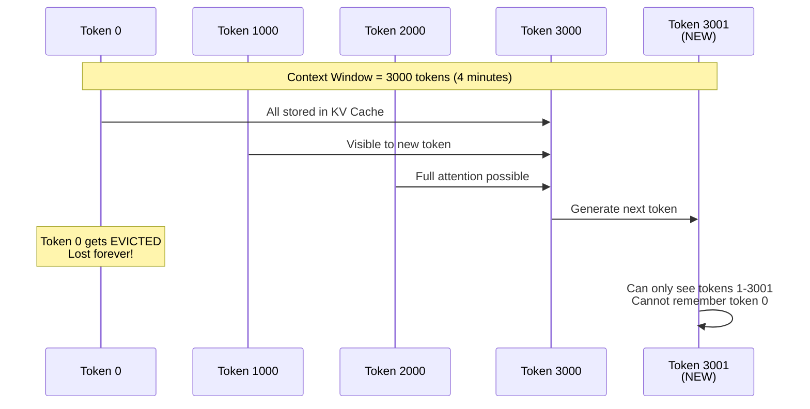
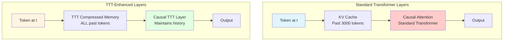
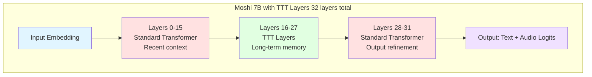
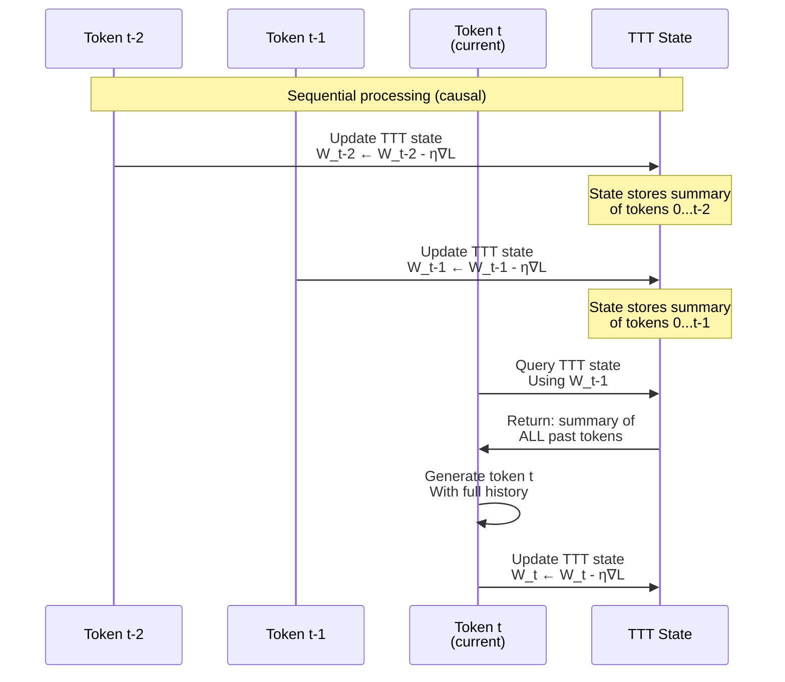
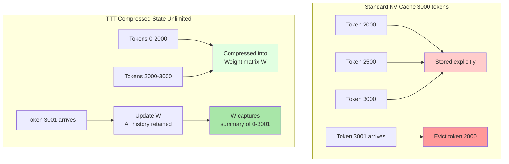
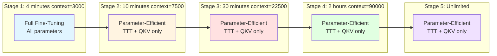
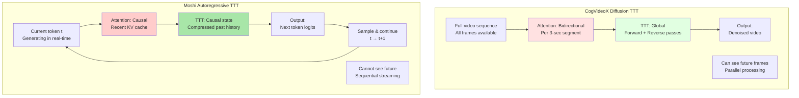
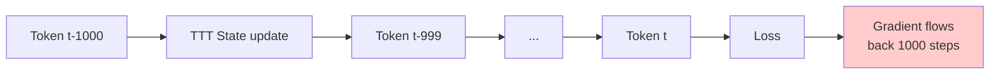
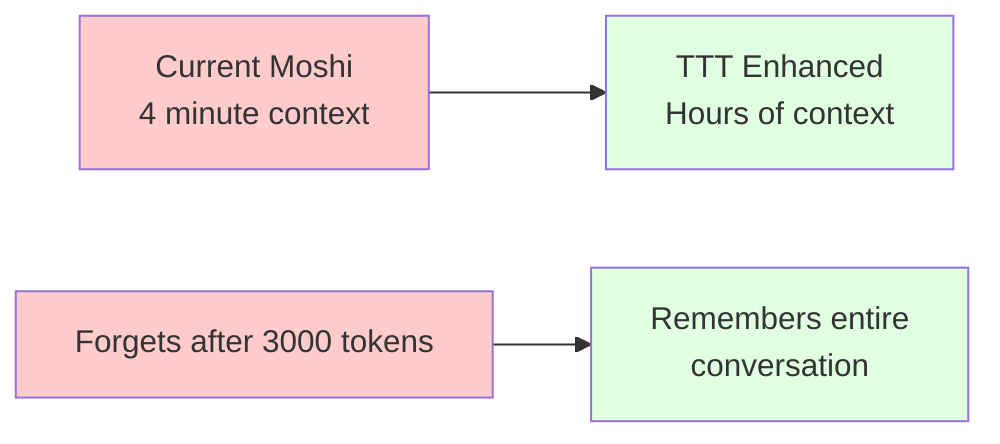

# TTT Layers for Autoregressive Models (Moshi)

## The Critical Difference: Diffusion vs Autoregressive

---

## Why CogVideoX's Approach Won't Work for Moshi

### CogVideoX (Diffusion Model)


**Key Properties:**
- ✅ Full sequence available before processing
- ✅ Can look backward AND forward
- ✅ TTT sees all frames globally
- ✅ Multiple refinement passes

### Moshi (Autoregressive Model)


**Key Constraints:**
- ❌ Future tokens don't exist yet
- ❌ Can ONLY look backward (causal)
- ❌ Must maintain streaming (real-time)
- ❌ Cannot iterate/refine (single pass)

---

## The Problem: Context Window Limitation

### Current Moshi Architecture



**The Problem:**
- After 4 minutes (3000 tokens), old context is **completely forgotten**
- Long conversations lose important context
- Cannot maintain coherent multi-hour dialogues

---

## Solution: TTT Layers for Causal Sequential Processing

### Adapting TTT to Autoregressive Constraints

The key insight: **TTT layers must be causal AND operate on the sequential history**.



### Key Differences in Design

| Aspect | CogVideoX TTT | Moshi TTT |
|--------|--------------|-----------|
| **Attention Scope** | Bidirectional (3-sec segments) | **Causal only (left-to-right)** |
| **TTT Scope** | Global (all frames) | **Causal (all past tokens)** |
| **"Whole Process"** | All frames in video | **All generated tokens so far** |
| **Training** | Parallel on full sequences | **Sequential with causal masking** |
| **Memory** | Segments available upfront | **Incremental streaming** |

---

## Proposed Architecture: Hybrid TTT-Transformer

### Layer Configuration



### Why This Split?

**Bottom Layers (0-15): Standard Transformer**
- Handle **recent context** (last few seconds/minutes)
- Fast attention over KV cache
- Capture immediate dependencies

**Middle Layers (16-27): TTT Layers**
- Compress and maintain **long-term memory**
- Summarize distant past efficiently
- Enable context beyond 4 minutes

**Top Layers (28-31): Standard Transformer**
- **Output refinement** with both recent + compressed context
- Predict next token using full history

---

## How Causal TTT Works

### Sequential State Update (Not Parallel)

Unlike CogVideoX where TTT sees the entire sequence, in Moshi, TTT updates incrementally:



**Key Property: Causal Sequential Processing**
- Each token only sees **past TTT state**
- TTT state is updated **after** token is generated
- No future information leakage
- Maintains streaming semantics

---

## TTT Layer Implementation for Causal Processing

### Standard Transformer Layer (Current Moshi)

```python
class StreamingTransformerLayer:
    def forward(self, x_t, kv_cache):
        # x_t: [B, 1, D] - single timestep
        # kv_cache: [B, H, T, D] - past 3000 tokens

        # 1. Append to KV cache
        k_t, v_t = self.proj_kv(x_t)
        kv_cache.append(k_t, v_t)  # Now contains t+1 entries

        # 2. Causal attention over ALL cached tokens
        q_t = self.proj_q(x_t)
        attn_out = causal_attention(q_t, kv_cache)

        # 3. FFN
        out = self.ffn(attn_out)

        return out
```

### TTT-Enhanced Layer (Proposed)

```python
class StreamingTTTLayer:
    def forward(self, x_t, ttt_state):
        # x_t: [B, 1, D] - single timestep
        # ttt_state: Compressed memory of ALL past tokens

        # 1. Query TTT state (get summary of all past)
        q_t = self.proj_q(x_t)
        k_t = self.proj_k(x_t)
        v_t = self.proj_v(x_t)

        # 2. TTT forward: use PAST state (causal)
        ttt_out = ttt_state.query(q_t)  # Summary of tokens 0...t-1

        # 3. Update TTT state with current token
        ttt_state.update(k_t, v_t, q_t)  # Now includes token t

        # 4. Output
        out = self.out_proj(ttt_out)

        return out, ttt_state  # Return updated state
```

**Critical Difference:**
- `ttt_state.query()` uses **previous state** (tokens 0...t-1)
- `ttt_state.update()` happens **after** query (maintains causality)
- State carries forward indefinitely (not limited to 3000 tokens)

---

## TTT State: Compressed Memory

### What Does TTT State Store?



### TTT State Structure

```python
@dataclass
class TTTState:
    """Compressed memory state for TTT layer."""

    # Learnable weight matrices (compressed memory)
    W1: torch.Tensor  # [num_heads, head_dim, hidden_dim]
    W2: torch.Tensor  # [num_heads, hidden_dim, head_dim]  (if MLP variant)
    b1: torch.Tensor  # [num_heads, 1, hidden_dim]
    b2: torch.Tensor  # [num_heads, 1, head_dim]

    # Learning rate gates (per-head adaptive)
    eta: torch.Tensor  # [num_heads, 1, 1]

    # Position tracking
    num_tokens_seen: int  # How many tokens processed so far

    # Optional: summary statistics
    mean_activation: torch.Tensor  # Running mean
    var_activation: torch.Tensor   # Running variance
```

**Key Insight:**
- Instead of storing all past tokens explicitly (O(T) memory)
- TTT compresses them into weight matrices W (O(D²) memory, constant!)
- W is updated incrementally as new tokens arrive
- Querying W retrieves compressed summary of entire history

---

## Training Strategy: Progressive Context Extension

### Same Philosophy as CogVideoX, Different Implementation



### Training Configuration (Proposed)

```toml
# Stage 1: 4 minutes (baseline Moshi context)
[model]
ssm_layer = "ttt_linear"
context = 3000                    # 4 minutes @ 12.5 Hz
ttt_layers = [16, 17, 18, 19, 20, 21, 22, 23, 24, 25, 26, 27]

[training]
adapter_method = "sft"            # Full SFT
global_batch_size = 32
steps = 5000

[optimizer]
lr = 1e-5
lr_ttt = 1e-4                     # TTT-specific (10× higher)
ttt_base_lr = 0.1

# Stage 2: 10 minutes
[model]
context = 7500                    # 10 minutes

[training]
adapter_method = "ttt_qkv_only"   # Only TTT + Q/K/V projections
steps = 3000

# Stage 3: 30 minutes
[model]
context = 22500                   # 30 minutes

# Stage 4: 2 hours
[model]
context = 90000                   # 2 hours

# Stage 5: Unlimited context
[model]
context = null                    # No context window limit!
```

---

## Key Architectural Differences: Diffusion vs Autoregressive TTT

### Processing Flow Comparison



### Comparison Table

| Dimension | CogVideoX (Diffusion) | Moshi (Autoregressive) |
|-----------|----------------------|------------------------|
| **Input** | Full noisy video sequence | Single token (current timestep) |
| **Attention Direction** | Bidirectional (see past & future) | **Causal only (past only)** |
| **TTT Processing** | Global (all frames at once) | **Sequential (incremental state)** |
| **TTT Direction** | Forward + Reverse passes | **Forward only (causal)** |
| **Segments** | 3-second video chunks | **Time chunks in conversation** |
| **"Whole Process"** | All frames in full video | **All generated tokens so far** |
| **Memory Model** | Parallel batch processing | **Streaming state (online)** |
| **Training** | Denoise full sequences | **Generate with causal masking** |
| **Context Limit** | Segment size (12 frames) | **3000 tokens → Unlimited with TTT** |
| **Real-time** | No (15+ seconds latency) | **Yes (80ms per token)** |

---

## Implementation Challenges

### 1. Maintaining Causality in TTT Updates

**Challenge:** TTT update must NOT leak future information

```python
# WRONG: This would leak future info
def ttt_forward_WRONG(x_t, ttt_state):
    # Update state with current token BEFORE querying
    ttt_state.update(x_t)  # ❌ Now state includes t
    out = ttt_state.query(x_t)  # ❌ Queries state with t included
    return out

# CORRECT: Query past state, then update
def ttt_forward_CORRECT(x_t, ttt_state):
    # Query state that only includes 0...t-1
    out = ttt_state.query(x_t)  # ✅ Uses past state
    # Update state to include t for NEXT token
    ttt_state.update(x_t)  # ✅ Updated after query
    return out
```

### 2. Gradient Flow Through Sequential States

**Challenge:** Backpropagation through long sequences



**Solution:** Gradient checkpointing + truncated BPTT

```python
# Checkpoint every N tokens to save memory
checkpoint_interval = 100

for t in range(T):
    if t % checkpoint_interval == 0:
        # Checkpoint: save state, discard computation graph
        torch.utils.checkpoint.checkpoint(ttt_layer, x_t, ttt_state)
    else:
        ttt_layer(x_t, ttt_state)
```

### 3. Memory Efficiency for Long Contexts

**Challenge:** Storing gradients for millions of tokens

**Solution:** Mini-batch TTT updates (same as CogVideoX)

```python
# Process in mini-batches of tokens
mini_batch_size = 256

for batch_start in range(0, T, mini_batch_size):
    batch_end = batch_start + mini_batch_size
    x_batch = x[batch_start:batch_end]

    # TTT update on mini-batch
    ttt_state = ttt_layer.forward_batch(x_batch, ttt_state)
```

### 4. Streaming Inference with TTT State

**Challenge:** Maintaining TTT state across streaming sessions

```python
class StreamingTTTState:
    """Persistent TTT state for streaming inference."""

    def save_checkpoint(self) -> dict:
        """Save TTT state to resume later."""
        return {
            'W1': self.W1.cpu(),
            'W2': self.W2.cpu(),
            'b1': self.b1.cpu(),
            'b2': self.b2.cpu(),
            'eta': self.eta.cpu(),
            'num_tokens_seen': self.num_tokens_seen,
            'mean_activation': self.mean_activation.cpu(),
            'var_activation': self.var_activation.cpu()
        }

    def load_checkpoint(self, checkpoint: dict):
        """Resume TTT state from checkpoint."""
        self.W1 = checkpoint['W1'].to(self.device)
        # ... load other state
        self.num_tokens_seen = checkpoint['num_tokens_seen']
```

**Use Case:** User pauses conversation, resumes hours later
- Save TTT state to disk
- Load TTT state when resuming
- Model remembers entire conversation history!

---

## Expected Benefits

### 1. Unlimited Context Window



### 2. Better Long-Form Coherence

**Example: Multi-hour conversation**

```
User (10:00 AM): My name is Alice and I love classical music.
Moshi: Nice to meet you, Alice! What composers do you enjoy?

User (11:30 AM): Can you recommend something to listen to?
Moshi: [Without TTT] I'd be happy to recommend music! What genre?
Moshi: [With TTT] Based on your love of classical music, Alice, I'd
                   recommend Beethoven's Piano Sonata No. 14...
```

### 3. Efficient Memory Usage

| Model | Context Length | Memory Usage |
|-------|----------------|--------------|
| **Standard KV Cache** | 3,000 tokens (4 min) | O(T × D) = ~24 MB |
| **Standard KV Cache** | 90,000 tokens (2 hr) | O(T × D) = ~720 MB ❌ |
| **TTT Compressed** | Unlimited | O(D²) = ~16 MB ✅ |

### 4. Maintains Real-Time Performance

- TTT update: ~2ms overhead per token
- Total latency: 80ms → 82ms (negligible)
- Still real-time capable!

---

## Visualization: How TTT Extends Context

### Standard Transformer (Current Moshi)

```mermaid
timeline
    title Standard Moshi: 4-Minute Sliding Window
    0:00 : Token 0-1000<br/>Stored in KV cache
    2:00 : Token 1000-2000<br/>Stored in KV cache
    4:00 : Token 2000-3000<br/>Stored in KV cache
    6:00 : Token 3000-4000<br/>Token 0-1000 LOST ❌
    8:00 : Token 4000-5000<br/>Token 1000-2000 LOST ❌
```

### TTT-Enhanced Transformer (Proposed)

```mermaid
timeline
    title TTT Moshi: Unlimited Compressed Context
    0:00 : Token 0-1000<br/>Compressed into TTT state
    2:00 : Token 1000-2000<br/>Compressed into TTT state
    4:00 : Token 2000-3000<br/>Compressed into TTT state
    6:00 : Token 3000-4000<br/>Token 0-3000 in TTT ✅
    8:00 : Token 4000-5000<br/>Token 0-4000 in TTT ✅
    1 hour : Token 0-45000<br/>ALL history in TTT ✅
```

---

## Comparison Summary

### The "Similar Approach" for Moshi

| Concept | CogVideoX Implementation | Moshi Implementation |
|---------|-------------------------|---------------------|
| **Segmentation** | 3-second video chunks | Time-based conversation chunks |
| **Local Processing** | Attention on 3-sec segments | Attention on recent KV cache |
| **Global Context** | TTT sees all frames | TTT compresses all past tokens |
| **Training Stages** | 3s → 9s → 18s → 30s → 63s | 4min → 10min → 30min → 2hr → ∞ |
| **Causality** | Bidirectional (diffusion) | **Strictly causal (autoregressive)** |
| **Streaming** | No (batch processing) | **Yes (online processing)** |
| **TTT Update** | Parallel (all frames) | **Sequential (token-by-token)** |

---

## Next Steps for Implementation

### Phase 1: Architecture Design
1. ✅ Understand Moshi's autoregressive constraints
2. ✅ Design causal TTT layer
3. ⬜ Implement `StreamingTTTLayer` class
4. ⬜ Integrate with existing `StreamingTransformer`

### Phase 2: Training Pipeline
1. ⬜ Prepare long-form conversation datasets
2. ⬜ Implement progressive training (4min → unlimited)
3. ⬜ Add TTT-specific optimizers and learning rates
4. ⬜ Gradient checkpointing for memory efficiency

### Phase 3: Evaluation
1. ⬜ Test on multi-hour conversations
2. ⬜ Measure context retention (perplexity over time)
3. ⬜ Benchmark memory usage vs standard transformer
4. ⬜ Measure latency overhead (should be <5ms)

---

## Conclusion

While the **philosophy** is similar (local + global processing), the **implementation** must be completely different:

**CogVideoX Approach:**
- ✅ Bidirectional attention on segments
- ✅ Global TTT on full sequence
- ✅ Parallel processing
- ❌ **Cannot work for autoregressive models**

**Moshi Approach (Proposed):**
- ✅ Causal attention on recent tokens
- ✅ Causal TTT state compression
- ✅ Sequential streaming
- ✅ **Maintains real-time generation**

The key insight: **TTT enables unbounded context for autoregressive models** by compressing the infinite past into fixed-size learned weights, updated incrementally as tokens are generated.

This is fundamentally different from CogVideoX's approach, but achieves a similar goal: **enabling long-range context while maintaining computational efficiency**.
